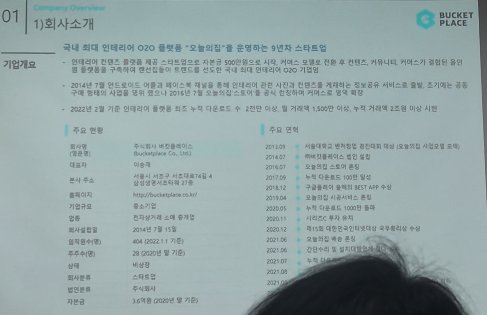

# Page 01 — 회사소개: 기업개요

## 섹션: 01 Company Overview > 1) 회사소개

## 핵심 내용
- **회사명**: 주식회사 버킷플레이스 (Bucketplace Co., Ltd.)
- **서비스명**: "오늘의집" — 국내 최대 인테리어 O2O 플랫폼
- **대표자**: 이승재
- **설립일**: 2014년 7월 15일
- **본사 주소**: 서울시 서초구 서초대로 74길 27층
- **기업규모**: 중소기업 → 스타트업
- **직원수**: 404 (2022.11 기준)
- **주주수**: 28 (2020년 말 기준)
- **자본금**: 16억원 (2020년 말 기준)
- **상장**: 비상장
- **인증**: 전자상거래 소매 등 업체

## 기업 연혁 요약
- 인테리어 컨텐츠 제공 스타트업으로 자본금 500만원으로 시작
- 커머스 모델로 전환 후 컨텐츠, 커뮤니티, 커머스가 결합된 통합 인테리어 O2O 기업으로 성장
- 2014년 7월: 안드로이드, 이듬해 iOS 제품 출시 → 인테리어 콘텐츠 게재/사진 정보공유 서비스 출발
- 2016년 7월: 오늘의집 스토어 오픈, 커머스 사업 본격화
- 2022년 2월 기준: 누적 다운로드 수 2천만 이상, 월 거래액 1,500억 이상, 누적 거래액 2조원 이상

## 주요 연혁 타임라인
| 시기 | 이벤트 |
|------|--------|
| 2011.09 | 서울대학교 벤처창업 인터넷 비즈니스 강의 수상 |
| 2014.07 | MNH 컨퍼런스 대상 수상 |
| 2016.01 | 오늘의집 스토어 오픈 |
| 2017.09 | 대한민국 모바일 대상 수상 |
| 2018.12 | 구글플레이 올해를 빛낸 BEST APP 수상 |
| 2019.04 | 스타일리시 시공/인테리어 서비스 론칭 |
| 2020.05 | 앱 다운로드 1000만 돌파 |
| 2020.11 | 시리즈C 투자유치 |
| 2020.12 | 앱 다운로드 1500만 돌파 |
| 2021.06 | 대한민국 인테리어 대상 국무총리상 수상 |
| 2021.06 | 시리즈C+ 유치 |
| 2021.07 | 기업가치 1조 달성 |
