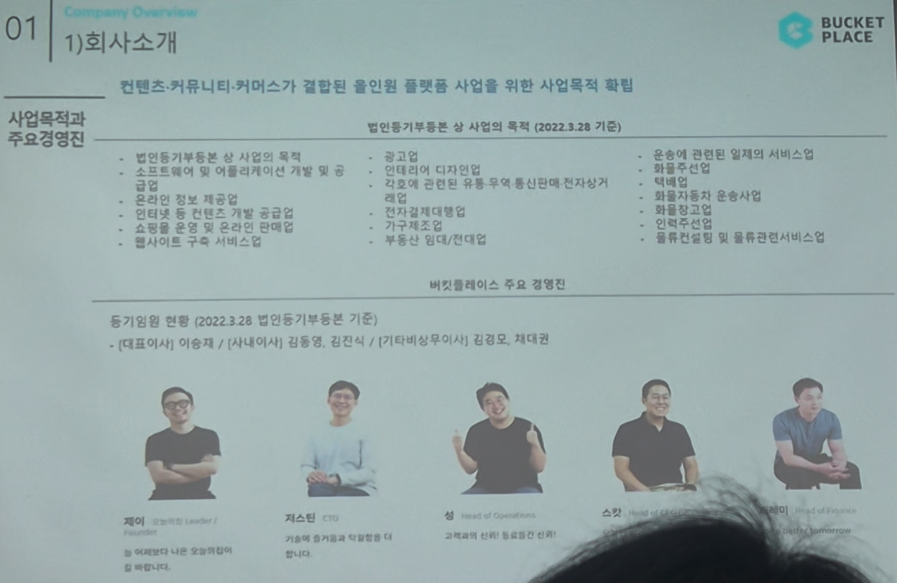

# Page 02 — 회사소개: 사업목적과 주요경영진

## 섹션: 01 Company Overview > 1) 회사소개

## 핵심 내용
- **사업목적**: 컨텐츠·커뮤니티·커머스가 결합된 올인원 플랫폼 사업을 위한 사업목적 확립

## 법인등기부등본 상 사업의 목적 (2022.3.28 기준)
- 법인등기부동산 상 사업의 목적:
  - 소프트웨어 및 어플리케이션 개발 및 공급
  - 온라인 정보 제공 서비스
  - 웹사이트 구축 서비스업
  - 광고업
  - 건설업, 인테리어, 전시업
  - 건설자재 및 유통 물건 판매 전자상거래
  - 캐팅(중개)
  - 가구/생활용품 제조업
  - 부동산 임대/전대
  - 문화예술 관련 일체의 서비스업
  - 화물자동차 운송사업
  - 물류전반 통합관리서비스업

## 주요 경영진
- **제이 (Jay)** — 대표이사 (CEO): 기술에 관기를 갖고 만들어내는 기획자. 前 매킨지인터내셔널 선임, 前 바로간 기획
- **지수킴 (Jisukim)** — CTO: 기술에 근거를 만들어내는 기술자
- **성 (Head of Operations)**: 오퍼레이션 총괄
- **스만 (Head of Marketing)**: 마케팅 총괄

## 등기임원 현황 (2022.3.28 기준)
- (대표이사) 이승재
- (사내이사) 김동명, 윤진식
- (기타비상무이사) 김경호, 제대관
