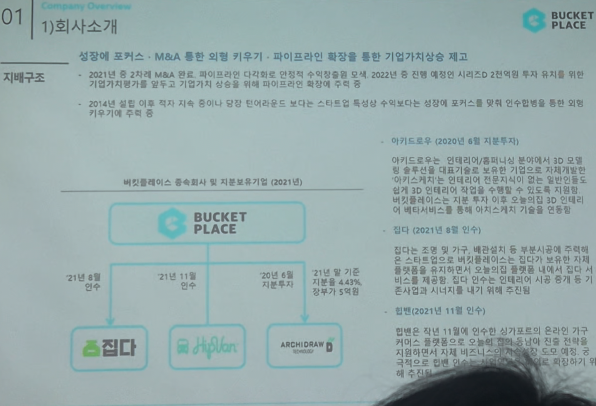

# Page 03 — 회사소개: 지배구조 (M&A / 종속회사)

## 섹션: 01 Company Overview > 1) 회사소개

## 핵심 내용
- **전략 방향**: 성장에 포커스 → M&A 통한 외형 키우기 → 파이프라인 확장을 통한 기업가치 상승 제고
- 2021년 중 2차례 M&A 진행, 파이프라인 다각화 및 단점 수요기반 확보
- 2022년 중 진행 예정인 시리즈D 2천억대 투자 유치를 위해 기업가치평가를 달무로 기업가치 상승을 위해 파이프라인 확장에 주력

## 종속회사 및 지분보유기업 (2021년)

### 버킷플레이스 → 집다 (2021년 6월 인수)
- 집다는 조립 및 가구 설치 분야 O2O 스타트업
- 버킷플레이스 스토어 구매 제품에 대한 시공/설치 서비스 제공 목적
- 비즈니스 제공 서비스 라인업 확대

### 버킷플레이스 → 아키드로우 (2020년 6월 지분투자)
- 인테리어 분야에서 3D 모델링 솔루션 제공 기업
- 버킷플레이스 자체 투자 이후 오늘의집 3D 뷰어/시뮬레이션 기능에 연동
- 21년 말 기준 지분율 4.43%

### 버킷플레이스 → 하플란 (2021년 11월 인수)
- 당년 11월 이후인 신규 커머스 플랫폼으로서 오프라인 매장 기반의 가구 커머스 시장 진출
- 사업영역에서 자체 배송, 물류 관리 역량 확보

### 버킷플레이스 → ARCHIDRAW (지분보유)
- 3D 인테리어 설계 솔루션 기업

## 요약
- 2014년 출범 이후 직접 자력 성장이 아닌 타인의 강점·특성을 수합해 성장에 포커스를 맞춰 인수합병을 통한 키우기에 주력
