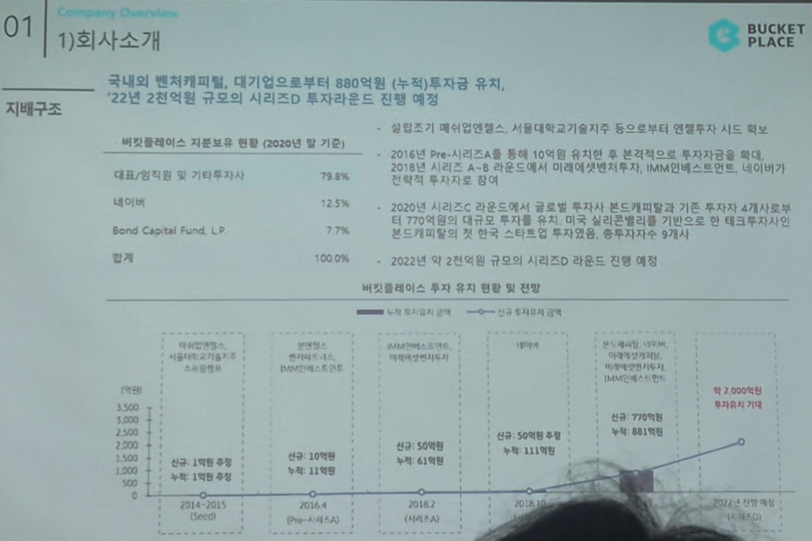

# Page 04 — 회사소개: 지배구조 (투자유치 현황)

## 섹션: 01 Company Overview > 1) 회사소개

## 핵심 내용
- **투자유치 규모**: 국내외 벤처캐피털, 대기업으로부터 880억원 (누적) 투자금 유치
- **2022년 예정**: 약 2천억원 규모의 시리즈D 투자라운드 진행 예정

## 지분보유 현황 (2020년 말 기준)
| 주주 | 지분율 |
|------|--------|
| 대표/임직원 및 기타투자사 | 79.6% |
| 네이버 | 12.5% |
| Bond Capital Fund, L.P. | 7.7% |
| **합계** | **100%** |

## 투자 라운드 타임라인

| 시기 | 라운드 | 신규 투자금 | 누적 투자금 |
|------|--------|-----------|-----------|
| 2014~2015 | Seed | ~1억원 추정 | - |
| 2016.4 | Pre-A/시리즈A | ~10억원 | ~11억원 |
| 2018.7 (UNPA) | 시리즈B | ~50억원 | ~61억원 |
| 2020 | 시리즈C | ~50억원 수준 | ~111억원 |
| 2021 | 시리즈C+ | ~770억원 | ~880억원 |
| 2022 (예정) | 시리즈D | - | 약 2,000억원 투자유치 기대 |

## 투자 세부 사항
- **2016년**: Pre-A/시리즈A로 총 10억원 유치 후 본격적으로 투자 시작, 시리즈 A-B 단계에서 이매진아시아투자, IMM인베스트먼트, 네이버 등이 참여
- **2020년**: 시리즈C 라운드에서 글로벌 투자사 본드캐피탈이 기존 1개에서 투자사 4개사로 확대, 약 770억원의 대규모 투자를 유치 (미국 실리콘밸리를 기반으로 하는 본드캐피탈의 첫 한국 스타트업 투자로서, 총투자사수 9개가 됨)
- **2022년**: 약 2천억원 규모의 시리즈D 라운드 진행 예정
