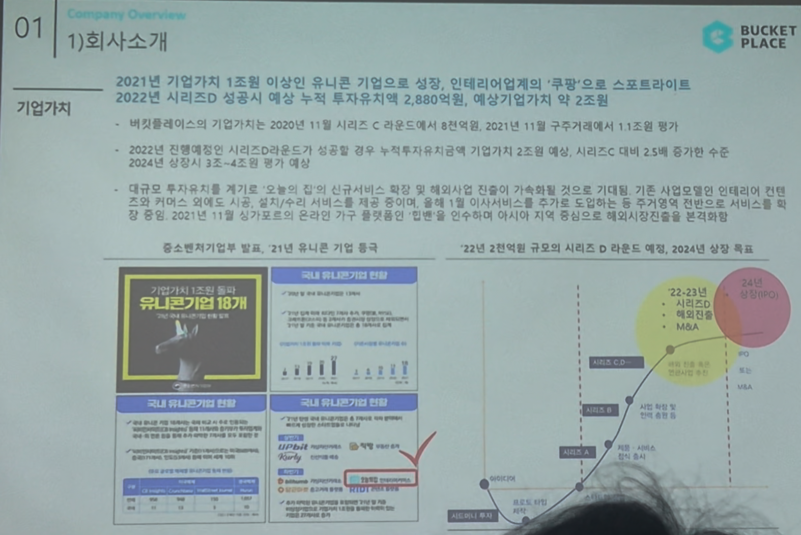

# Page 05 — 회사소개: 기업가치

## 섹션: 01 Company Overview > 1) 회사소개

## 핵심 내용
- **2021년 기업가치 1조원 이상 유니콘 기업으로 성장** — 인테리어업계의 '쿠팡'으로 스포트라이트
- **2022년 시리즈D 성공시**: 예상 누적 투자유치금 2,880억원, 예상기업가치 약 2조원

## 기업가치 변화
- 2020년 11월: 시리즈C 라운드에서 6~8억달러
- 2021년 11월: 구주거래에서 11조원 수준
- 2022년 진행예정인 시리즈D 라운드는 2조원 수준 → 누적투자가치 2조원 예상, 시리즈C 대비 2.5배 성장 수준
- 2024년 상장시 3~4조원 범위 예상

## 유니콘 기업 현황
- 중소벤처기업부 발표, 2021년 유니콘 기업 18개 달성
- 버킷플레이스(오늘의집)가 국내 유니콘기업 반열에 포함
- 기업가치 1조원 달성

## 향후 전망
- 대규모 투자유치를 기반으로 '오늘의집' 신규서비스 확장에 가속화될 전망
- 기존 사업 모델의 확장과 함께, 이사/시공 서비스를 강화 예정
- 온라인 가구 플랫폼 중심으로 오프라인 기구 매장 분야에도 본격 진출
- 2024년 상장 목표

## 시리즈D 이후 로드맵 (22~23년)
- 시리즈D 투자유치
- M&A 추가 진행
- 2024년 상장 추진
