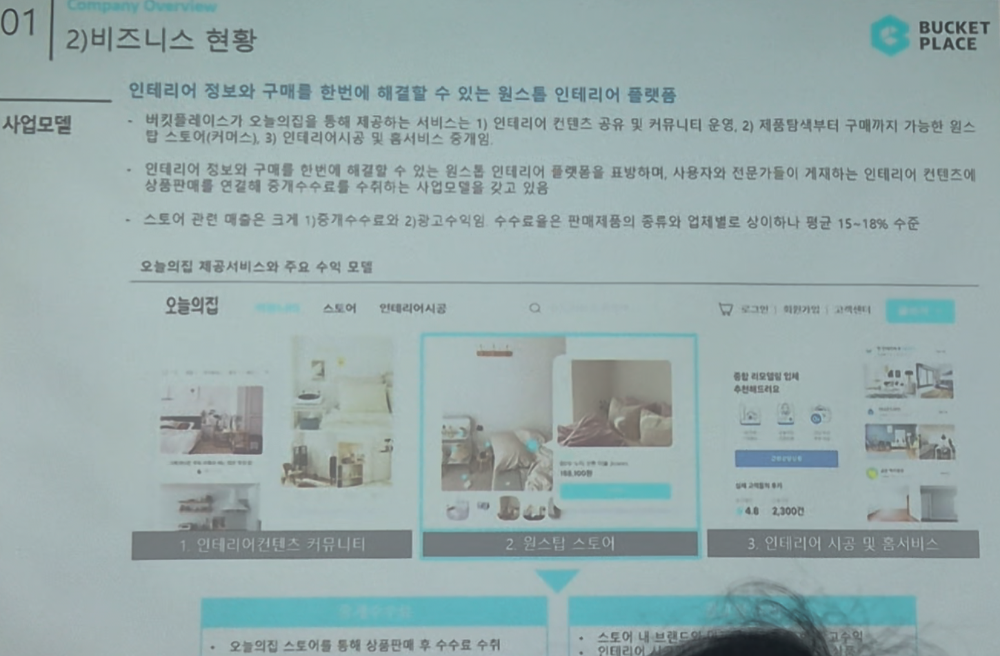

# Page 06 — 비즈니스 현황: 사업모델 (원스톱 플랫폼)

## 섹션: 01 Company Overview > 2) 비즈니스 현황

## 핵심 내용
- **사업모델**: 인테리어 정보와 구매를 한번에 해결할 수 있는 **원스톱 인테리어 플랫폼**
- 버킷플레이스가 '오늘의집'을 통해 제공하는 서비스:
  1. 인테리어 컨텐츠 공유 및 커뮤니티 운영
  2. 제품정보부터 구매까지 가능한 스토어/커머스
  3. 인테리어서비스 및 홈서비스 중개

## 3C 모델 (컨텐츠 + 커뮤니티 + 커머스)
- 인테리어 정보와 구매를 한번에 해결할 수 있는 **원스톱** 인테리어 플랫폼
- 사용자와 전문가들이 게시한 인테리어 컨텐츠가 커머스로 연결
- 상품판매에 인테리어 중개수수료를 통해 수익화

## 주요 수익 모델
- 오늘의집 스토어를 통해 상품판매 후 수수료 수익
- 스토어 관련 매출은 크게 두 가지:
  1. 중개수수료
  2. 판매수수료 — 판매제품의 종류와 업체별로 상이하나 평균 15~18% 수준

## 플랫폼 구성 요소
1. **인테리어 컨텐츠 커뮤니티** — 사진/영상 공유, 인테리어 노하우
2. **원스톱 스토어** — 가구/소품/생활용품 구매
3. **인테리어 시공 및 홈서비스** — 전문가 중개, 시공 서비스
