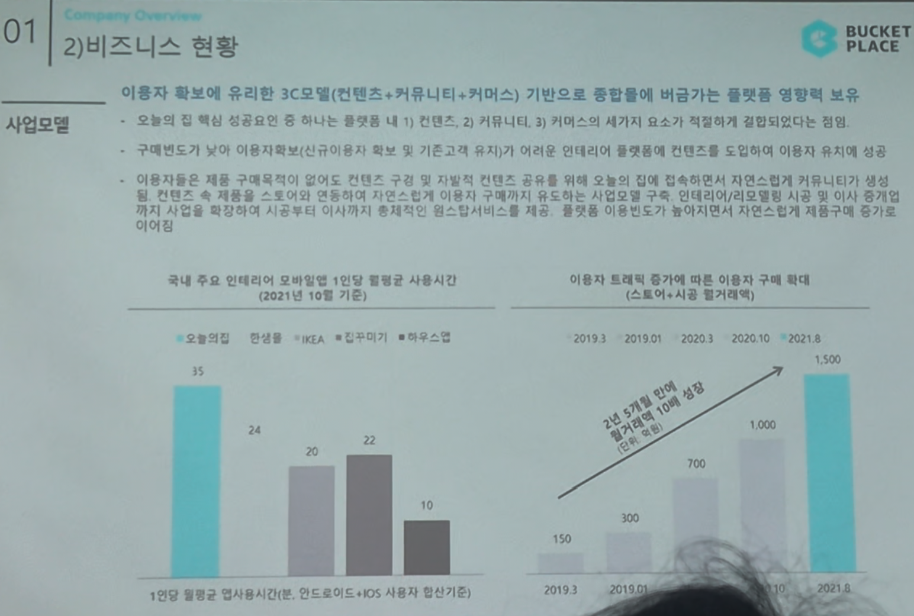

# Page 07 — 비즈니스 현황: 사업모델 (플랫폼 영향력)

## 섹션: 01 Company Overview > 2) 비즈니스 현황

## 핵심 내용
- **3C 모델** (컨텐츠 + 커뮤니티 + 커머스) 기반으로 종합적으로 비교가능한 플랫폼 영향력 보유
- 이용자 확보에 유리한 구조: 컨텐츠로 유입 → 커뮤니티에서 체류 → 커머스로 전환

## 플랫폼 선순환 구조
- 구매패턴이 높아 이용자확대 (신규이용자 확보 및 기존고객 유지)가 여타 인테리어 플랫폼 대비 용이
- 이용자들은 제품 구매목적이 없어도 컨텐츠 감상을 위해 오늘의집을 방문
- 컨텐츠 속 제품 스크린 → 상품페이지 → 자연스러운 구매 전환 (커뮤니티 → 커머스)
- 결과적으로 체류시간 증가 → 이용자 기반 확대

## 국내 주요 인테리어 모바일 앱 1인당 평균 사용시간 (2021년 10월 기준)
| 앱 | 1인당 평균 사용시간 (분) |
|----|----------------------|
| **오늘의집** | **35** |
| 한샘 | 24 |
| IKEA | 20 |
| 집꾸미기 | 22 |
| 하우스 | 10 |

- 오늘의집이 경쟁사 대비 **압도적인 체류시간** 보유

## 이용자 트래픽 증가에 따른 이용자 구매 확대 (스토어/시공 거래액)
| 시기 | 월거래액 |
|------|---------|
| 2019.3 | 50 |
| 2019.01 | 100 |
| 2020.3 | 150 |
| 2020.10 | 700 |
| 2021 | 1,000+ |
| 2021.8 | 1,300+ |

- 2년 5개월 만에 월거래액 10배 성장 (약 150 → 1,500억원)

> *1인당 평균사용시간(분): 안드로이드 + iOS 사용자 환산기준*
