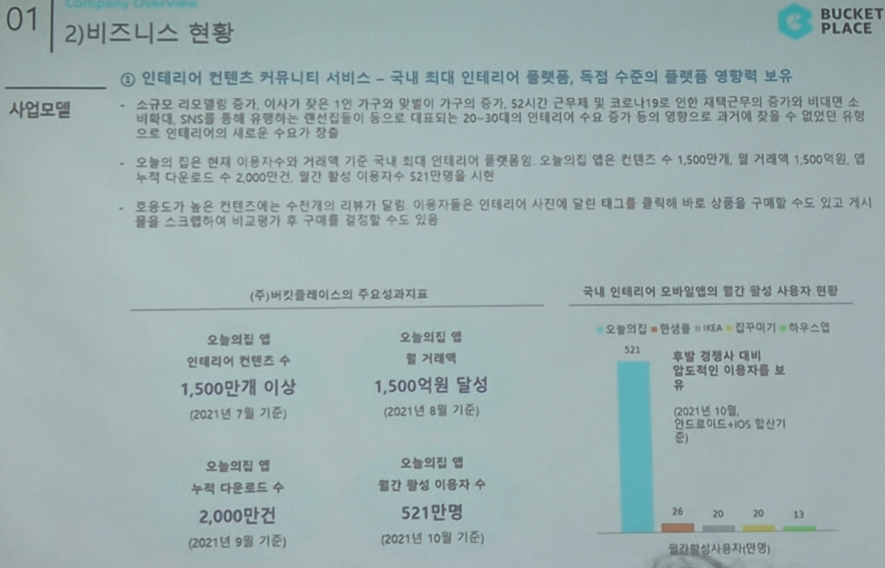

# Page 08 — 비즈니스 현황: 사업모델 (핵심 성과 지표)

## 섹션: 01 Company Overview > 2) 비즈니스 현황

## 핵심 내용
- **인테리어 컨텐츠 커뮤니티 서비스** = 국내 최대 인테리어 플랫폼, 독점 수준의 플랫폼 영향력 보유
- 코로나19 이후 재택근무 증가, 2~30대 1인/2인 가구 증가로 인테리어에 대한 새로운 수요 창출

## (주)버킷플레이스의 주요성과지표

| 지표 | 수치 | 기준일 |
|------|------|--------|
| 인테리어 컨텐츠 수 | **1,500만개 이상** | 2021년 7월 기준 |
| 월 거래액 | **1,500억원 달성** | 2021년 8월 기준 |
| 누적 다운로드 수 | **2,000만건** | 2021년 9월 기준 |
| 월간 활성 이용자 수 | **521만명** | 2021년 10월 기준 |

## 국내 인테리어 모바일앱의 월간 활성 사용자 현황
| 앱 | MAU (만명) |
|----|-----------|
| 오늘의집 | **521** |
| 한생 | - |
| IKEA | - |
| 집꾸미기 | - |
| 하우스 | - |

- 오늘의집이 **압도적인 MAU 1위** (2위 대비 약 10배 이상)

## 시장 트렌드
- 규모의 컨텐츠를 기반으로 생활에 맞춤화된 가구/인테리어 추천 제공
- 비대면 SNS를 통해 유입되는 2~30대의 인테리어에 대한 높은 관심 → 새로운 수요
- 오늘의집 플랫폼의 누적 컨텐츠 수 1,500만건, 월 거래액 1,500억원, 누적 다운로드 수 2,000만건, 월간 활성 이용자 수 521만명 달성

## 활성이용자 트렌드
- 2021년 10월 기준 안드로이드 + iOS 합산 기준
- 향후 모바일러인의 이용자를 본격적으로 확보하면 더 큰 성장 가능
