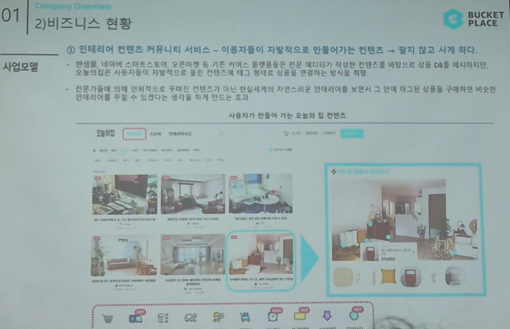

# Page 09 — 비즈니스 현황: 사업모델 (컨텐츠 커뮤니티 서비스)

## 섹션: 01 Company Overview > 2) 비즈니스 현황

## 핵심 내용
- **컨텐츠 커뮤니티 서비스**: 이용자들이 자발적으로 만들어가는 컨텐츠 → **팔지 않고 사게 하다**
- 핵심 경쟁력은 **UGC (User Generated Content)** 기반의 자연스러운 커머스 전환

## 컨텐츠 생성 방식
- 핀터레스트, 네이버 스마트스토어, 오픈마켓 등 기존 커머스 플랫폼은 에디터가 직접 착한한 컨텐츠를 DB 형식으로 제시
- **오늘의집은 다르다**: 사용자들이 자발적으로 본인 집 컨텐츠를 촬영해 태그 정보를 넣어 공유하는 연쇄적인 방식으로 확장
- 전문가들에 의해 인위적으로 꾸며진 컨텐츠가 아닌 **현실세계 자연스런 인테리어**를 보면서 → 그 안에 태그된 상품을 구매하게 되는 **비주얼 쇼핑** 구조

## 사용자가 만들어 가는 오늘의 집 컨텐츠 흐름
1. 사용자가 인테리어 사진을 업로드
2. 사진 속 제품에 **태그(상품 링크)** 부착
3. 다른 사용자가 사진을 보고 태그를 클릭
4. 자연스럽게 상품 페이지로 이동 → **구매 전환**

## 핵심 가치
- "**팔지 않고 사게 하다**" — 광고가 아닌 자연스러운 컨텐츠 기반 커머스
- 사용자 인테리어 사진 → 태그 → 구매 → 또 다른 사용자의 사진 업로드 → **선순환 구조**
- 이 모델 덕분에 컨텐츠 확보에 별도 비용 없이 지속 성장 가능
