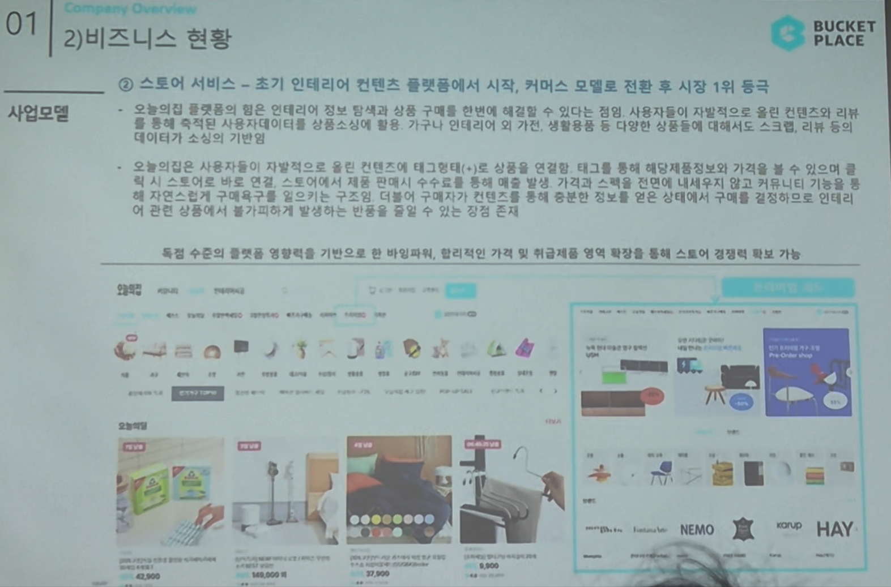

# Page 10 — 비즈니스 현황: 사업모델 (스토어 서비스)

## 섹션: 01 Company Overview > 2) 비즈니스 현황

## 핵심 내용
- **스토어 서비스**: 초기 인테리어 컨텐츠 플랫폼에서 시작 → 커머스 모델로 전환 후 시장 1위 등극

## 스토어 서비스 특징
- 오늘의집 플랫폼에서 탑재된 인테리어 정보·팁 등과 상품 구매를 한번에 해결할 수 있다는 점이 사용자들이 자발적 컨텐츠와 관계를 통해 올려 사진 속 제품을 자연스럽게 노출 → 상품소비에 이끄는 구조 (컨텐츠가 커머스를 견인)
- 독립 수준의 플랫폼 영향력을 기반으로 비바리퍼, 할리적인 가격 위 취급제품 영역 확장을 통해 스토어 경쟁력 확대 가능

## 오늘의집 컨텐츠→커머스 전환 플로우
1. 사용자가 자발적으로 올린 인테리어 사진에 **태그(상품 태그)**를 붙여 해당 아이템 정보와 가격을 노출
2. 스토어로 바로 연결 → 스토어에서 직접 구매 가능 (수수료 발생)
3. 가격과 스펙 정보로 인테리어에 대해 알지 못하던 사용자까지 자연스럽게 구매 전환
4. 다양한 상품들의 스크롤, 리뷰 등 제공

## 입점 브랜드
- NEMO, KOPUD, HAY 등 다수 인테리어/가구 브랜드 입점
- 독점 수준의 플랫폼 장악력으로 취급제품 영역 확장 중
