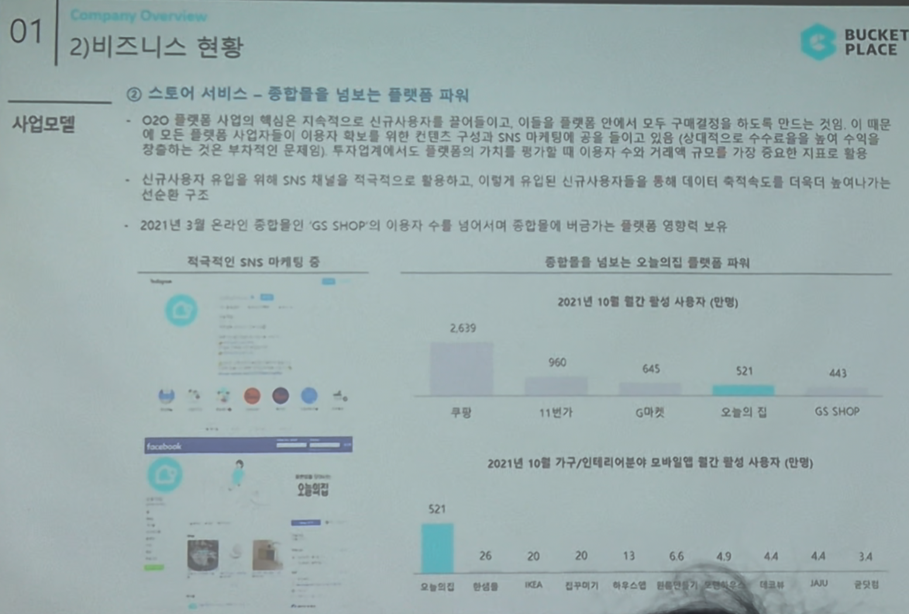

# Page 11 — 비즈니스 현황: 사업모델 (종합몰을 넘보는 플랫폼 파워)

## 섹션: 01 Company Overview > 2) 비즈니스 현황

## 핵심 내용
- **스토어 서비스**: 종합몰을 넘보는 플랫폼 파워
- O2O 플랫폼을 사업적으로 지속적으로 신규사용자를 불러들이고, 이들을 플랫폼 안에서 모두 구매해결까지 하도록 유도
- 모든 종합몰 사업자들이 이용자 확대를 위해 컨텐츠 구성과 SNS 마케팅에 많은 자원을 투입하는 반면, 오늘의집은 이용자 수 확장에 별도 수익을 쓰지 않아도 되는 구조

## 플랫폼 파워 비교 (2021년 10월 월간 활성 사용자, 만명)
| 플랫폼 | MAU |
|--------|-----|
| 쿠팡 | 2,639 |
| 무신사 | 960 |
| 당근마켓 | 645 |
| 오늘의집 | **521** |
| GS SHOP | 443 |

- 오늘의집이 **종합몰급 MAU**(521만명)에 근접 — GS SHOP(443만)을 추월

## 가구/인테리어 분야 모바일 앱 월간 활성 사용자 (2021년 10월, 만명)
| 앱 | MAU |
|----|-----|
| 오늘의집 | **521** |
| 한샘몰 | 26 |
| IKEA | 20 |
| 집꾸미기 | 13 |
| 기타 | 6.6 이하 |

- 오늘의집 MAU가 2위(한샘몰 26만)의 **약 20배** → 독점적 지위

## 선순환 구조
- 신규사용자 유입을 위해 SNS 채널을 적극적으로 활용
- 신규사용자들을 통해 데이터 축적 속도 증가 → 더 다양한 컨텐츠 확보 → 더 많은 사용자 유입의 선순환
- 2021년 3월 온라인 중합몰인 'GS SHOP'의 이용자 수를 넘어서며 종합몰에 버금가는 플랫폼 영향력 보유
