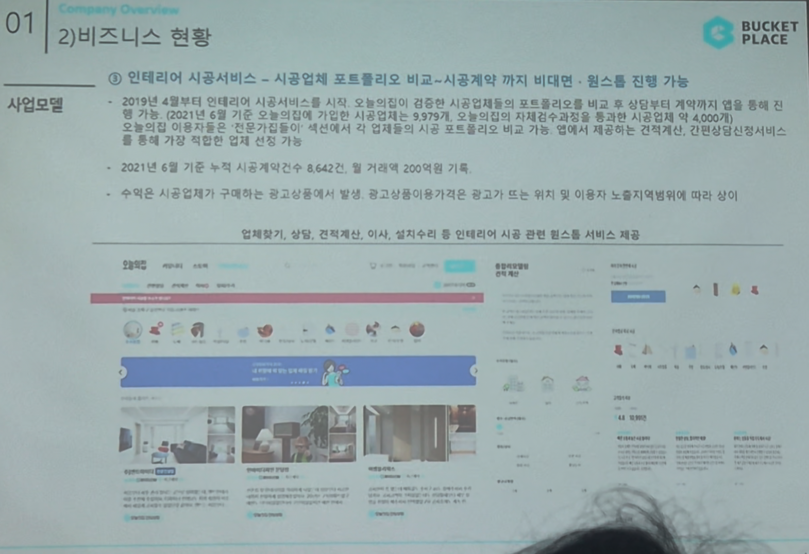

# Page 12 — 비즈니스 현황: 인테리어 시공서비스

## 섹션: 01 Company Overview > 2) 비즈니스 현황

## 핵심 내용
- **인테리어 시공서비스**: 시공업체 포트폴리오 비교 → 시공계약까지 비대면·원스톱 진행 가능

## 시공서비스 개요
- 2019년 4월부터 인테리어 시공서비스 시작
- 오늘의집이 검증한 시공업체들의 포트폴리오를 비교 → 상담부터 계약까지 앱을 통해 진행 가능
- 2021년 6월 기준 시공업체는 약 9,379개, 오늘의집이 시공체계 관리/운영을 통해 시공업체 약 4,000가구 진행
- 인테리어 시공뿐 아니라 집수리, 이사 서비스까지 확대 중

## 주요 성과 (2021년 6월 기준)
- 누적 시공계약건수: **8,642건**
- 월 거래액: **200억원 기준**

## 수익 구조
- 시공업체가 구매하는 광고상품에서 발생
- 광고상품 이용가격은 광고가 뜨는 위치 및 이용자 노출 지역/범위에 따라 상이

## 서비스 범위
- 업체찾기, 상담, 견적제안, 이사, 설치수리 등 인테리어 시공 관련 **원스톱 서비스** 제공
