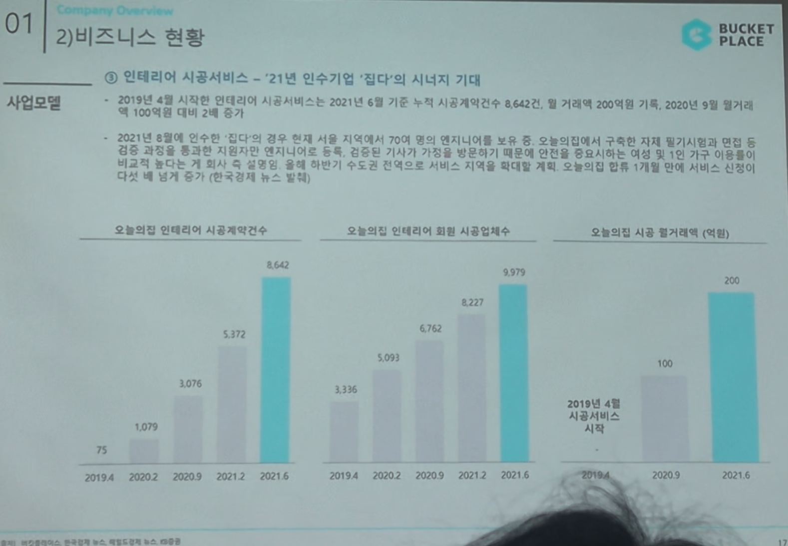

# Page 13 — 비즈니스 현황: 시공서비스 (집다 인수 시너지)

## 섹션: 01 Company Overview > 2) 비즈니스 현황

## 핵심 내용
- **인테리어 시공서비스**: 2021년 인수기업 '집다'와의 시너지 기대
- 2019년 4월 시작한 시공서비스가 빠르게 성장 중

## 집다 인수 효과
- 2021년 8월 인수한 '집다'와의 공유로 약 70여 명의 엔지니어를 보유
- 오늘의집에서 구축한 각종 필기/시공 데이터에 집다의 엔지니어를 통해 집중적 기술과 가치를 발전시킬 수 있음
- 시공 이용자의 대상을 확대: 1인 가구 이용자들의 다양한 홈관리까지 확대 예정
- 도배/입주 청소 등 소규모 시공으로 시작해서 확대 계획, 토탈 인테리어 시공 + 시너지 신규사업 발굴

## 핵심 성과 지표 추이

### 오늘의집 인테리어 시공계약건수
| 시기 | 건수 |
|------|------|
| 2019.6 | 75 |
| 2020.2 | 1,079 |
| 2020.9 | 3,076 |
| 2021.2 | 5,372 |
| 2021.6 | **8,642** |

### 오늘의집 인테리어 회원 시공업체수
| 시기 | 업체수 |
|------|--------|
| 2019.4 | 1,136 |
| 2020.2 | 3,093 |
| 2020.9 | 5,762 |
| 2021.2 | 8,227 |
| 2021.6 | **9,379** |

### 오늘의집 시공 월거래액 (억원)
| 시기 | 월거래액 |
|------|---------|
| 2019.4 | 시공서비스 시작 |
| 2020.3 | 100 |
| 2021.6 | **200** |
