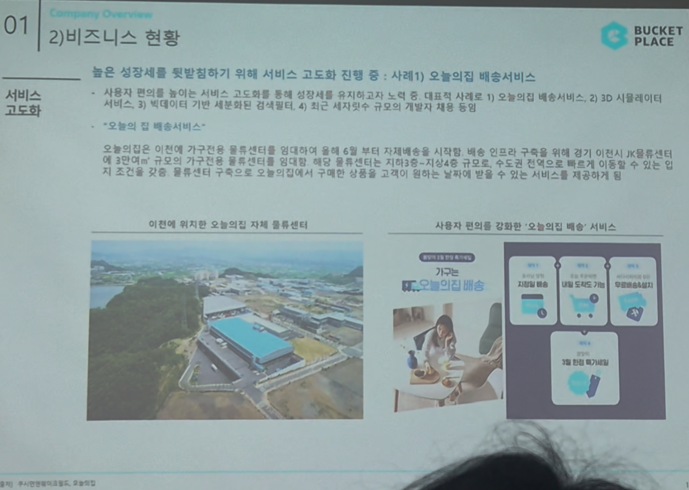

# Page 14 — 비즈니스 현황: 서비스 고도화 (오늘의집 배송서비스)

## 섹션: 01 Company Overview > 2) 비즈니스 현황

## 핵심 내용
- **서비스 고도화 사례 1**: 오늘의집 배송서비스
- 높은 성장세를 뒷받침하기 위해 서비스 고도화 진행 중

## 배송서비스 배경
- 사용자 편의를 높이는 서비스 고도화를 통해 성장세를 유지하고자 노력
- 대표적 사례: 오늘의집 배송서비스, 2D 시뮬레이션 이를 활용한 3D 시뮬레이션까지
- 빅데이터 기반 세분화된 검색엔진 4차 최근 세지만큼 규모의 개발자 채용 등

## "오늘의집 배송서비스"
- 이천에 자체 물류센터 설립 (JK물류센터)
- 약 4천 평의 물류센터를 통해 자체배송 시작
- 배송 인프라 구축으로 경기 이천시 JK물류센터 및 수도권 인근으로 빠른 배송 가능
- 가구는 규모의 가구는 지원하는 기사 설치까지 가능

## 사용자 편의를 강화한 오늘의집 배송 서비스
- 리얼 배송 추적
- 내일 도착 (빠른 SMS 기능)
- 개별 전화 필요 없음
- 제품 장인 특가 배송
