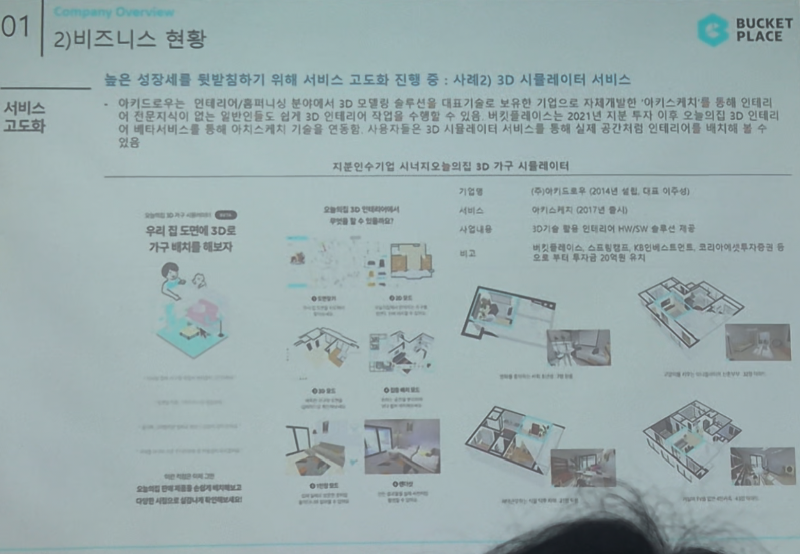

# Page 15 — 비즈니스 현황: 서비스 고도화 (3D 시뮬레이터 서비스)

## 섹션: 01 Company Overview > 2) 비즈니스 현황

## 핵심 내용
- **서비스 고도화 사례 2**: 3D 시뮬레이터 서비스
- 아키드로우(인테리어/홈퍼니싱 분야에서 3D 모델링 솔루션 대표기술 보유 기업)를 개발/연동

## 3D 시뮬레이터 서비스 개요
- '아키스케치' 등을 활용해 인테리어 분야에 전문지식이 없는 일반인도 본인 3D 인테리어에 다양한 제품을 배치 가능
- 버킷플레이스는 2021년 시장 추이 이후 오늘의집 3D 인테리어 서비스를 통해 실감 공간체험 제공 예정

## 지분인수기업 시너지: 아키드로우 3D 가구 시뮬레이터

### 기업 정보
- **기업명**: (주)아키드로우 (2014년 설립, 대표 이우수)
- **서비스명**: 아키스케치 (2017년 출시)
- **사업내용**: 10만개 이상 인테리어 가구/마감재 3D 설루션 가구 제공
- **비고**: 버킷플레이스, 스토어팜, 한샘/LG하우시스, 코오롱이에이아이투자/중소기업 등 주요 고객

## 기능
1. **공간 제작**: 우리 집 도면에 3D로 가구 배치를 해보자
2. **공간 설계**: 도면에 맞추어 제품 배치
3. **물량 분석**: 인테리어 비용 견적 산출
4. **3D 뷰어/포토**: 실감나는 3D 렌더링 이미지 제공
