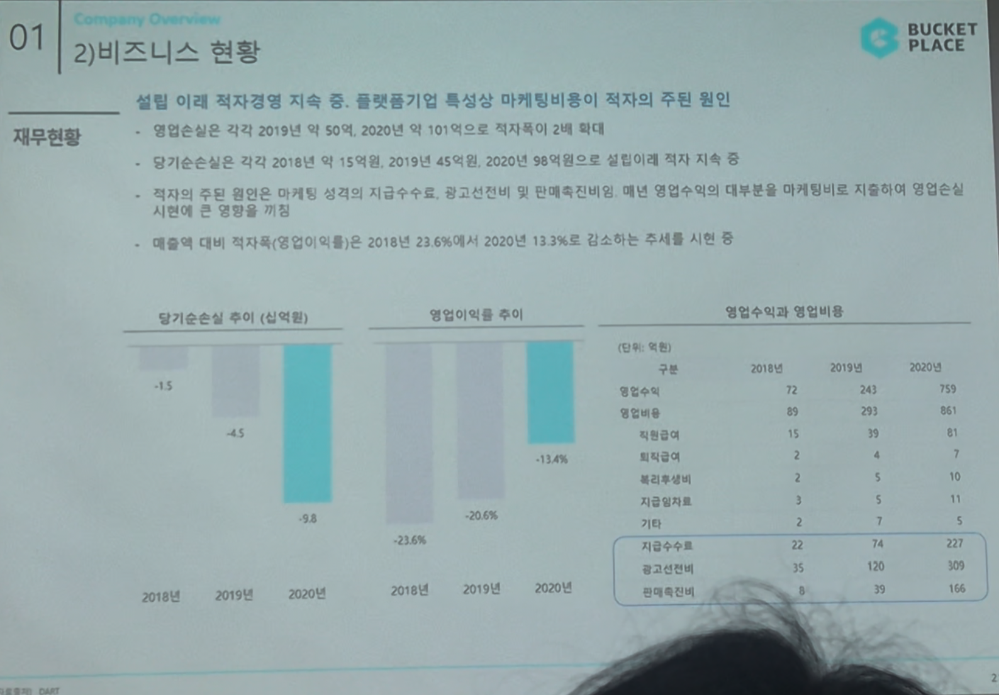

# Page 16 — 비즈니스 현황: 재무현황

## 섹션: 01 Company Overview > 2) 비즈니스 현황

## 핵심 내용
- **재무현황**: 설립 이래 적자경영 지속 중 — 플랫폼기업 특성상 마케팅비용이 적자의 주된 원인

## 손익 현황

### 당기순손실 추이 (십억원)
| 연도 | 당기순손실 |
|------|-----------|
| 2018년 | -15 |
| 2019년 | -43 |
| 2020년 | -58 |

- 영업손실은 각각 2019년 약 50%, 2020년 약 101억으로 적자폭이 2배 확대
- 당기순손실은 각각 2018년 약 15억, 2019년 45억, 2020년 58억으로 일정비례 적자 지속 중

### 영업이익률 추이
| 연도 | 영업이익률 |
|------|-----------|
| 2018년 | -15.4% |
| 2019년 | -20.6% |
| 2020년 | -23.6% |

- 매출액 대비 적자폭 (영업이익률)은 2018년 23.6%에서 2020년 13.1%로 **감소하는 추세** (개선 중)

## 영업수익과 영업비용 (단위: 억원)

| 항목 | 2018년 | 2019년 | 2020년 |
|------|--------|--------|--------|
| 영업수익 | 73 | 243 | 759 |
| 영업비용 | 13 | 39 | 81 |
| 원가비율 | 2 | 4 | 7 |
| 매출총이익 | - | - | - |
| 판관비 | 5 | 3 | 11 |
| 기타 | 2 | 7 | 1 |
| **지급수수료** | **22** | **74** | **227** |
| **광고선전비** | **25** | **120** | **306** |
| 기타 | 39 | 35 | 144 |

- **적자의 주요 원인**: 지급수수료(22→227억)와 광고선전비(25→306억)가 매년 급증
- 플랫폼 성장기 특성상 매년 영업수익의 대부분을 마케팅비로 지출하며 영업손실 시현 (적자 지속)
