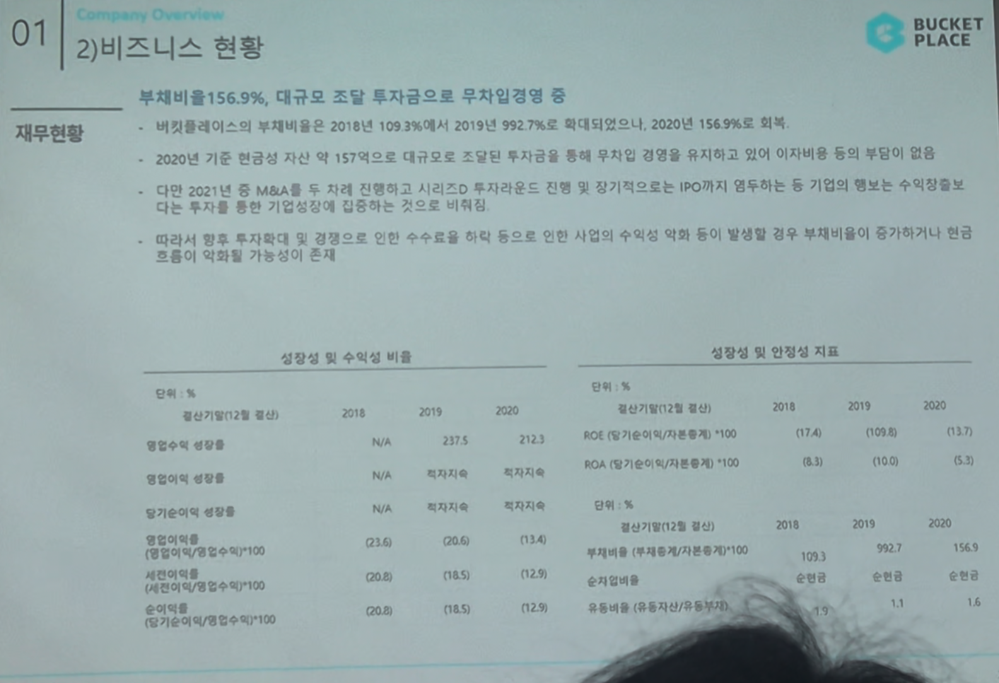

# Page 17 — 비즈니스 현황: 재무현황 (성장성 및 안정성 지표)

## 섹션: 01 Company Overview > 2) 비즈니스 현황

## 핵심 내용
- **부채비율 156.9%**, 대규모 조달 투자금으로 **무차입경영** 중
- 2020년 기준 현금성 자산만 157억으로 대규모 조달된 투자금을 통해 무차입 경영을 하고 있어 이자비용의 부담이 없음

## 성장성 및 수익성 비율

| 지표 | 2018 | 2019 | 2020 |
|------|------|------|------|
| 총자산(기말/12월 말) | N/A | N/A | 212.3 |
| 영업수익 성장률 | - | - | - |
| 영업이익 성장률 | N/A | 적자지속 | 적자지속 |
| 당기순이익 성장률 | - | - | - |
| 매출총이익률 (영업이익/영업수익*100) | 0.16 | (0.5) | (1.4) |
| 세전이익률 (세전이익/영업수익*100) | (35.0) | (19.6) | (12.6) |
| 순이익률 (순이익/영업수익*100) | (25.0) | (18.5) | (12.8) |

## 성장성 및 안정성 지표

| 지표 | 2018 | 2019 | 2020 |
|------|------|------|------|
| ROE (자기자본이익률) | - | (17.4) | (15) |
| RCA (매출기여이익/매출액/총자산*100) | - | - | (15) |
| 부채비율 (부채/총자본*100) | - | - | 55.5 |
| 총자산(기말/12월 말 억원) | - | - | 300 |
| 부채총계 (부채총계/자본총계*100) | - | - | 99.2 |
| 유치건 | - | - | 1.1 |
| 유동비율 (유동자산/유동부채) | - | - | (1.1) |

## 요점
- M&A 등 투자금으로 자본잠식에는 다가가고 있으나 IPO가 없고 장기적으로는 기업의 영속에 수익성을 다시 확보해야 하는 비기업적 과제 존재
- 향후 투자/확대에 따른 광고·마케팅 수수료를 어떻게 효율적으로 통제하면서 수익 역전을 만들어 시점의 수익성 역전 필요
