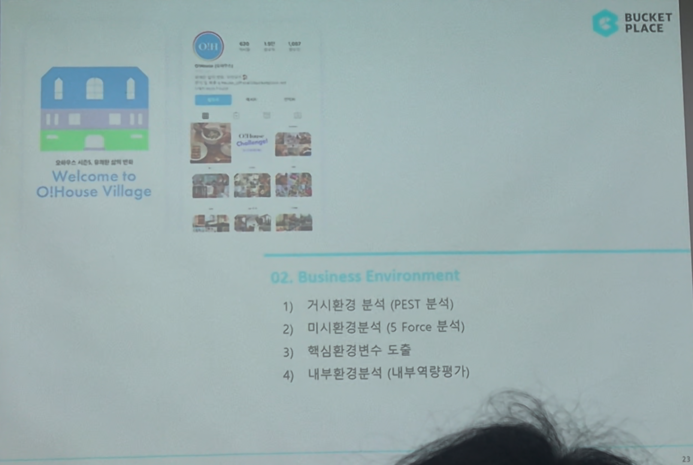

# Page 18 — 섹션 전환: 02 Business Environment 목차

## 섹션: 02 Business Environment (경영환경 분석)

## 핵심 내용
- **섹션 전환 페이지**: "Welcome to O!House Village" 일러스트와 오늘의집 인스타그램 프로필 이미지
- 02장 Business Environment의 목차 소개

## 02장 구성
1. **거시환경 분석 (PEST 분석)**
2. **미시환경분석 (5 Force 분석)**
3. **핵심환경변수 도출**
4. **내부환경분석 (내부역량평가)**

## 비고
- 오늘의집 인스타그램: 팔로워 수 표시 (약 226만+, 4,907 게시물, 1,887 팔로워 표시)
- 이 섹션부터 본격적인 경영환경 분석(외부·내부) 시작
