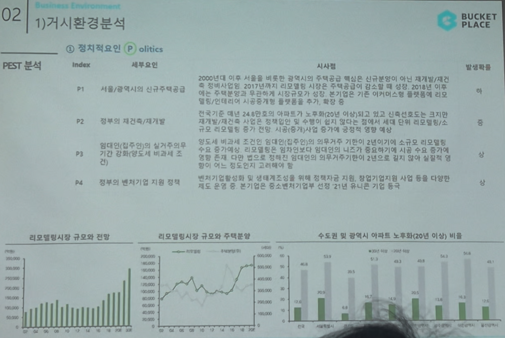

# Page 19 — 거시환경 분석: PEST - 정치적요인 (Politics)

## 섹션: 02 Business Environment > 1) 거시환경 분석

## PEST 분석 - P (Politics)

| Index | 세부요인 | 시사점 | 발생확률 |
|-------|--------|--------|---------|
| P1 | 서울/광역시의 신규주택공급 | 2000년대 이후 서울을 비롯한 광역시의 주택공급 핵심은 신규분양이 아닌 재개발/재건축. 2017년까지 리모델링 시장은 주택공급의 감소에 따라 형성. 2018년 이후 리모델링 확대 | 중 |
| P2 | 정부의 재건축/재개발 | 한국은 대비 24.8건으로 아파트가 노후화(20년 이상)되고 있고, 신규건축이 크게 줄면서 리모델링/재건축 시장은 확대될 전망. 정부 정책 변화에 따라 인테리어 수요 증가 | 중 |
| P3 | 임대인(집주인)의 실거주의무/기간 강화(양도세 비과세 조건) | 임대인의 실거주의무 강화로 인테리어 수요 증가. 정부가 전세 대비 장기거래로 인테리어 의향 확대 예상 | 중 |
| P4 | 정부의 벤처기업 지원 정책 | 정부의 벤처/스타트업 지원 확대, 특히 플랫폼 경제 분야 지원이 오늘의집에 유리한 환경 조성 | 중 |

## 관련 데이터 차트
1. **리모델링시장 규모와 전망** — 꾸준한 성장세
2. **리모델링시장 규모와 주택분양** — 신규 주택분양 감소 시 리모델링 수요 증가 상관관계
3. **수도권 및 광역시 아파트 노후화(20년 이상) 비율** — 지속 증가 추세
