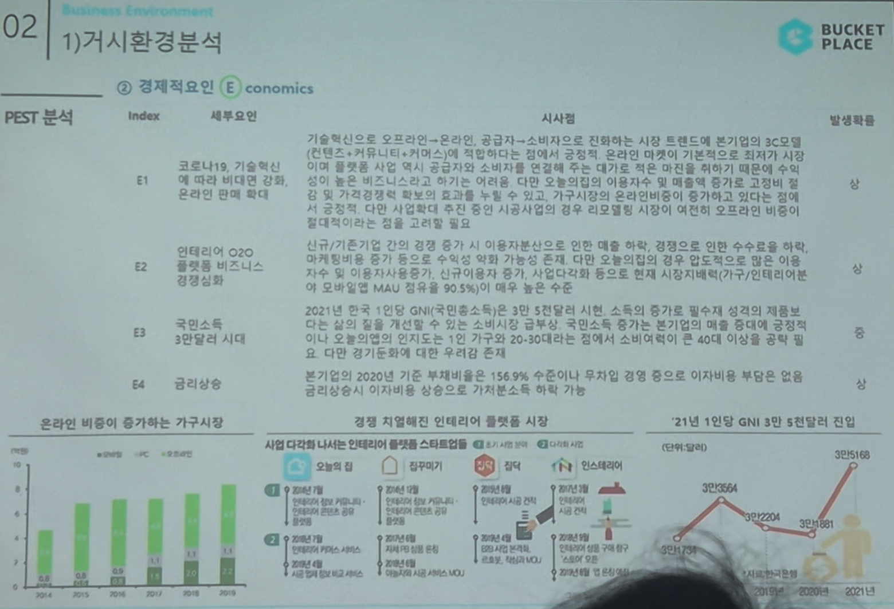

# Page 20 — 거시환경 분석: PEST - 경제적요인 (Economics)

## 섹션: 02 Business Environment > 1) 거시환경 분석

## PEST 분석 - E (Economics)

| Index | 세부요인 | 시사점 | 발생확률 |
|-------|--------|--------|---------|
| E1 | 코로나19, 기술혁신에 따라 비대면 강화, 온라인 판매 확대 | 기술혁신으로 오프라인→온라인, 공급자→소비자으로 전환되는 시장 트렌드에 본 기업의 보유 온라인/비대면/커머스에 적합하다는 점에서 온라인 마켓에서 기본역량의 우위를 보유. 가격경쟁력 확보 및 배송 능력 증강 등을 통해 온라인 가구시장의 온라인화비율이 증가하여 시장 확장 | 상 |
| E2 | 인테리어 O2O 플랫폼 비즈니스 경쟁심화 | 신규/기존기업 간의 진입 증가 시 이용자분산으로 매출 하락 위험. 대응으로 인터 마케팅 비용 증가 예상. 오늘의집의 독점적 지위 유지가 핵심 | 중 |
| E3 | 국민소득 3만달러 시대 | 2021년 한국 1인당 GNI(국민총소득)가 3만 5천달러 시대. 소비의 질 중심으로 높아져 삶의 질 개선에 집중. 소비패턴 변화가 인테리어 시장 수요 확대로 작용 | 상 |
| E4 | 금리상승 | 이 기업의 2020년 기준 부채비율 156% 수준이니 투자자금 공급에 부담은 없으나, 향후 금리 상승시 투자유치 환경 악화 가능 | 중 |

## 관련 데이터 차트
1. **온라인 비중이 증가하는 가구시장** — 온라인 가구 구매 비중 지속 상승
2. **업종 직업별로 다양해진 인테리어 플랫폼 시장** — 오늘의집, 집꾸미기, 당근마켓, 인스테리어 등 다양한 플레이어
3. **21년 1인당 GNI 3만 5천달러 진입** — 국민소득 증가 → 소비 질 향상 → 인테리어 시장 확대
