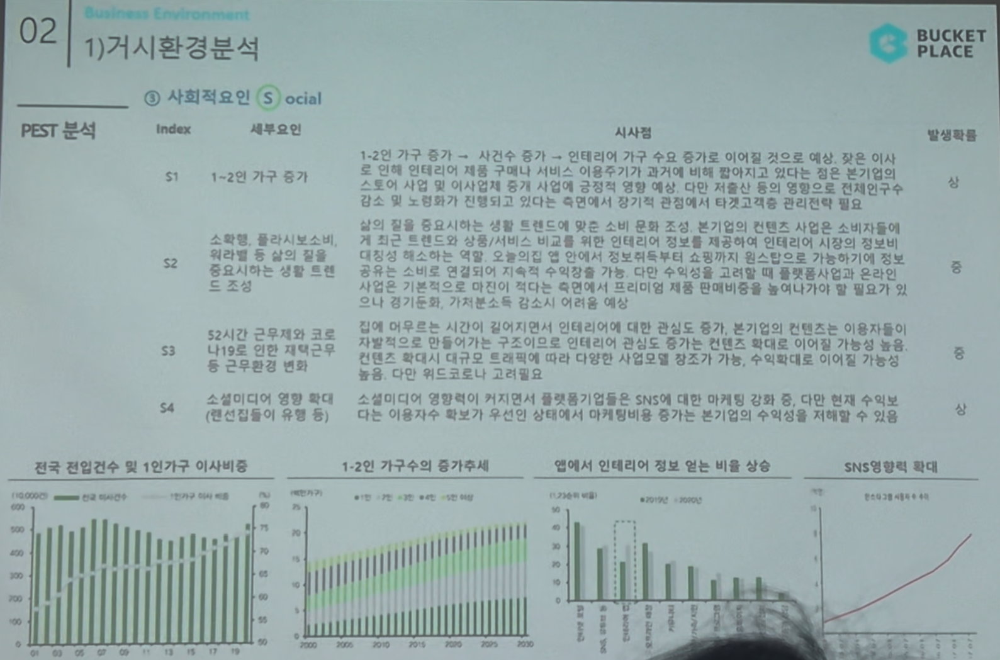

# Page 21 — 거시환경 분석: PEST - 사회적요인 (Social)

## 섹션: 02 Business Environment > 1) 거시환경 분석

## PEST 분석 - S (Social)

| Index | 세부요인 | 시사점 | 발생확률 |
|-------|--------|--------|---------|
| S1 | 1~2인 가구 증가 | 1~2인 가구 증가 → 시간수 증가 → 인테리어 가구 수요 증가는 이에맞춰 인테리어 합리적 소비에 대한 수요 상승. 분기별 이사가 많은 1~2인 가구의 특성상 인테리어 시장 성장에 기여 | 상 |
| S2 | 소확행, 홈퍼니싱 트렌드 조성 | 삶의 질을 중시하는 소비 트렌드에 맞춰 조닝, 본인만의 편안한 공간 확보 니즈 증가. 인테리어에 관한 정보를 손쉽게 확인하여 편매를 증가시키는 홈퍼니싱 트렌드 조성 | 상 |
| S3 | 52시간 근무제, 코로나19를 인한 재택근무 등 근무환경 변화 | 집에 머무르는 시간이 증가 → 인테리어 관심도 증가 → 컨텐츠 확대 → 이용자가 늘어남으로 자연스럽게 시장 확대. 수월(매출 인식) 기능, 수익매출 및 수수료 수익 증대 | 상 |
| S4 | 소셜미디어 영향 확대 (랜선집들이 유행 등) | 오늘의집이 영향력 있는 미디어/커뮤니티들로 SNS에 입소문 마케팅 강화. 더 많은 사용자의 유입 증가하고 분기별 수익 증대 가능 | 상 |

## 관련 데이터 차트
1. **전국 전입건수 및 1인가구 이사비율** — 1인 가구 이사 비율 꾸준히 증가
2. **1~2인 가구수의 증가추세** — 인구구조 변화가 인테리어 수요 견인
3. **집에서 인테리어 정보를 보는 비율 상승** — 코로나 이후 급증
4. **SNS영향력 확대** — 소셜미디어를 통한 인테리어 정보 확산 트렌드
