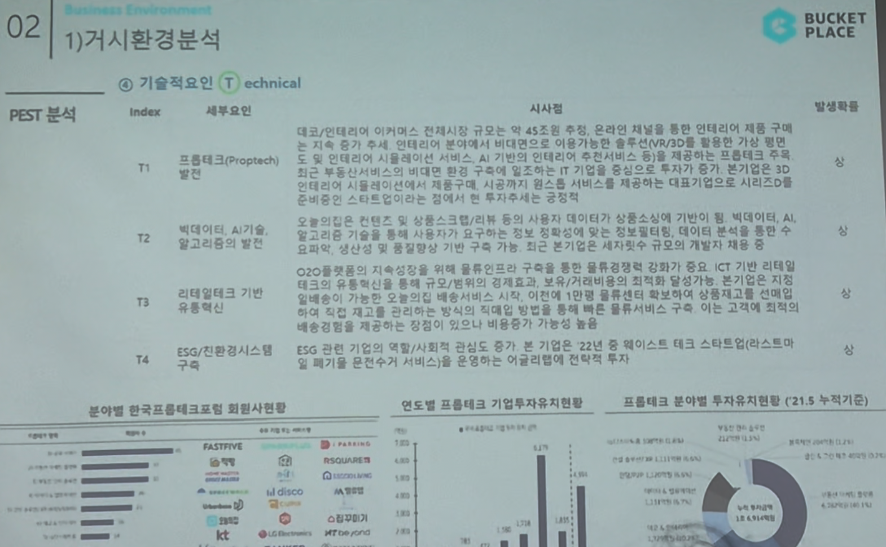

# Page 22 — 거시환경 분석: PEST - 기술적요인 (Technical)

## 섹션: 02 Business Environment > 1) 거시환경 분석

## PEST 분석 - T (Technical)

| Index | 세부요인 | 시사점 | 발생확률 |
|-------|--------|--------|---------|
| T1 | 프롭테크(Proptech) 발전 | 대표 인테리어·이커머스 컨텐츠 기업 → 약 43조 규모의 프롭테크 시장 성장과 함께 인테리어 분야도 혁신적 기술 구매 패턴 변화 예상. AI 기반 개인화 추천, 솔루션 제공 등 플랫폼의 기술 혁신 가능성 증가 | 상 |
| T2 | 빅데이터, AI기술, 알고리즘의 발전 | 컨텐츠 및 상품소비에 기반이 되는 빅데이터, AI, 알고리즘 발전으로 가구/제품 큐레이션 정교화. ICT 부문 리테일과 기술 접목 강화 | 상 |
| T3 | 리테일테크 기반 유통혁신 | 가구/인테리어 온라인 유통에서 AR/VR 기반 제품 체험, 개인화 추천, 실시간 배송 추적 등 혁신적 쇼핑 경험 제공 가능. 상품후기와 검색 알고리즘 고도화 | 상 |
| T4 | ESG/친환경시스템 구축 | ESG 관련 기업의 책임/사회적 관심도 증가로 본 기업은 22년도 해리스트 대표 스타트업으로 선정. 친환경 관련 메거진 서비스를 통해 브랜드 가치 제고 가능 | 중 |

## 관련 데이터 차트
1. **분야별 한국프롭테크포럼 회원사 현황** — 다양한 분야(FASTFIVE, 직방, Zigbang 등) 프롭테크 기업 활동 중
2. **연도별 프롭테크 기업투자유치현황** — 투자 규모 급증 추세
3. **프롭테크 분야별 투자유치현황 (21.5 누적, 억원)** — 인테리어/홈퍼니싱 분야 비중 확인
