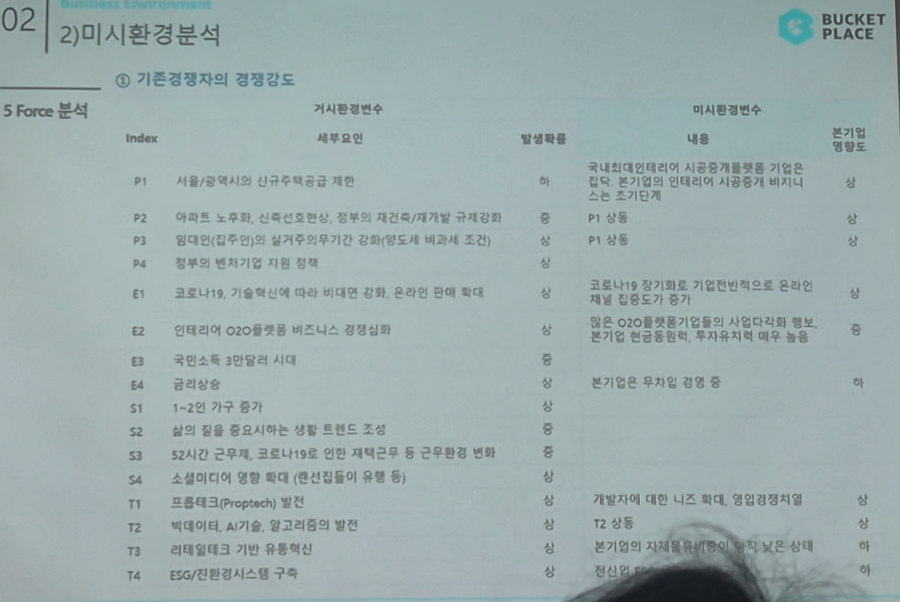

# Page 23 — 미시환경 분석: 5 Force - 기존경쟁자의 경쟁강도

## 섹션: 02 Business Environment > 2) 미시환경분석

## 5 Force 분석 - ① 기존경쟁자의 경쟁강도

### 거시환경변수 → 미시환경변수 매핑

| Index | 세부요인 | 발생확률 | 미시환경변수 내용 | 분기별 영향도 |
|-------|--------|---------|---------------|-----------|
| P1 | 서울/광역시의 신규주택공급 제한 | 중 | 국내 전체 인테리어 시공/재개발/리모델링 분야에서 시공중개 서비스는 초기단계 | - |
| P2 | 아파트 노후화, 신축건축 감소, 정부의 재건축/재개발 규제강화 | 중 | P1 상동 | - |
| P3 | 임대인(집주인)의 실거주의무기간 강화(양도세 비과세 조건) | 중 | P1 상동 | - |
| P4 | 정부의 벤처기업 지원 정책 | 중 | - | - |
| E1 | 코로나19, 기술혁신에 따라 비대면 강화, 온라인 판매 확대 | 상 | 코로나19로 창기적로 기업전반적으로 온라인 매체 집중도가 증가 | - |
| E2 | 인테리어 O2O플랫폼 비즈니스 경쟁심화 | 상 | 많은 O2O플랫폼기업들이 사업다각화 확보. 본기업은 컨텐츠를 중심으로 투자비용 및 경쟁 | - |
| E3 | 국민소득 3만달러 시대 | - | - | - |
| E4 | 금리상승 | - | 분기별 무차입 경쟁 | - |
| S1~S4 | 사회적 요인들 | - | - | - |
| T1 | 프롭테크(Proptech) 발전 | - | - | - |
| T2 | 빅데이터, AI기술, 알고리즘의 발전 | - | T2 상동 | - |
| T3 | 리테일테크 기반 유통혁신 | - | - | - |
| T4 | ESG/친환경시스템 구축 | - | - | - |
