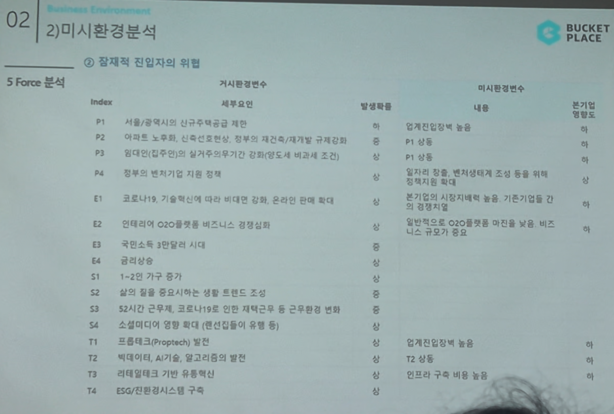

# Page 24 — 미시환경 분석: 5 Force - 잠재적 진입자의 위협

## 섹션: 02 Business Environment > 2) 미시환경분석

## 5 Force 분석 - ② 잠재적 진입자의 위협

### 거시환경변수 → 미시환경변수 매핑

| Index | 세부요인 | 발생확률 | 미시환경변수 내용 | 분기별 영향도 |
|-------|--------|---------|---------------|-----------|
| P1 | 서울/광역시의 신규주택공급 제한 | 중 | 잠재적진입장벽 높음 | - |
| P2 | 아파트 노후화, 신축건축 감소 | 중 | - | - |
| P3 | 임대인(집주인)의 실거주의무기간 강화 | 중 | P1 상동 | - |
| P4 | 정부의 벤처기업 지원 정책 | 중 | 일정 취지 벤처/창업투자로 조성. 신규 등 들어 취향 만족/성장 확대 | - |
| E1 | 코로나19, 기술혁신 비대면 강화 | 상 | - | - |
| E2 | 인테리어 O2O플랫폼 비즈니스 경쟁심화 | 상 | 일반적으로 O2O플랫폼 마진은 낮은 비즈니스 규모가 필요 | - |
| T1 | 프롭테크(Proptech) 발전 | - | 업계진입장벽 높음 | - |
| T2 | 빅데이터, AI기술, 알고리즘의 발전 | - | T2 상동 | - |
| T3 | 리테일테크 기반 유통혁신 | - | 인프라 구축 비용 높음 | - |

## 핵심 분석
- **진입장벽이 높은 편**: 플랫폼 비즈니스 특성상 초기 사용자 기반 확보에 대규모 투자 필요
- 빅데이터/AI 기반의 기술 인프라 구축 비용이 높아 신규 진입자의 위협은 상대적으로 낮음
- 다만, 대형 O2O 플랫폼 기업들의 사업다각화를 통한 진입 가능성은 존재
