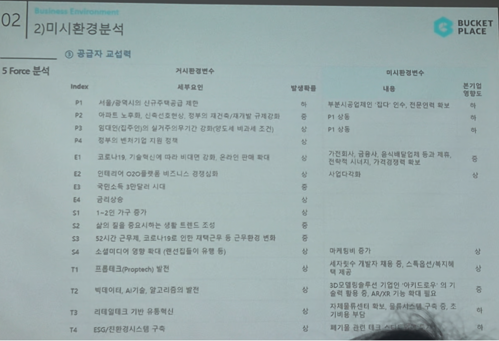

# Page 25 — 미시환경 분석: 5 Force - 공급자 교섭력

## 섹션: 02 Business Environment > 2) 미시환경분석

## 5 Force 분석 - ③ 공급자 교섭력

### 거시환경변수 → 미시환경변수 매핑

| Index | 세부요인 | 발생확률 | 미시환경변수 내용 | 분기별 영향도 |
|-------|--------|---------|---------------|-----------|
| P1 | 서울/광역시의 신규주택공급 제한 | 중 | 부분시공/전체인테리어 집다 인수, 전문인력 확보 | 중 |
| P2 | 아파트 노후화, 신축건축 감소 | 중 | - | - |
| P3 | 임대인(집주인)의 실거주의무기간 강화 | 중 | P1 상동 | - |
| E1 | 코로나19, 기술혁신 비대면 강화 | 상 | 가전회사, 공유소, 홈서비스 업체들이 분야 진출 및 제휴, 사업 시시각비, 가격경쟁 심화 | 중 |
| E2 | 인테리어 O2O플랫폼 비즈니스 경쟁심화 | 상 | - | - |
| T1 | 프롭테크(Proptech) 발전 | - | 세지·쉬수 개발자 채용 중, 스톡옵션 등 인센티브 | - |
| T2 | 빅데이터, AI기술, 알고리즘의 발전 | - | 3D모델링솔루션 기업인 '아키드로우'에 설치 이용한 AR/XR 기술 확보 필요 | - |
| T3 | 리테일테크 기반 유통혁신 | - | 자체물류센터 확대, 물류서비스를 통해 구축 가능 | - |
| T4 | ESG/친환경시스템 구축 | - | 폐기물 관련 서비스 대응 필요 | - |

## 핵심 분석
- **공급자 교섭력 중간 수준**
- 집다 인수를 통해 시공 분야 인력/역량 내재화
- 아키드로우 투자로 3D 기술 솔루션 확보
- 자체 물류센터(이천 JK물류센터)로 물류 역량 강화
- 개발자 채용 경쟁이 심화되는 시장에서 인재 확보가 중요 과제
