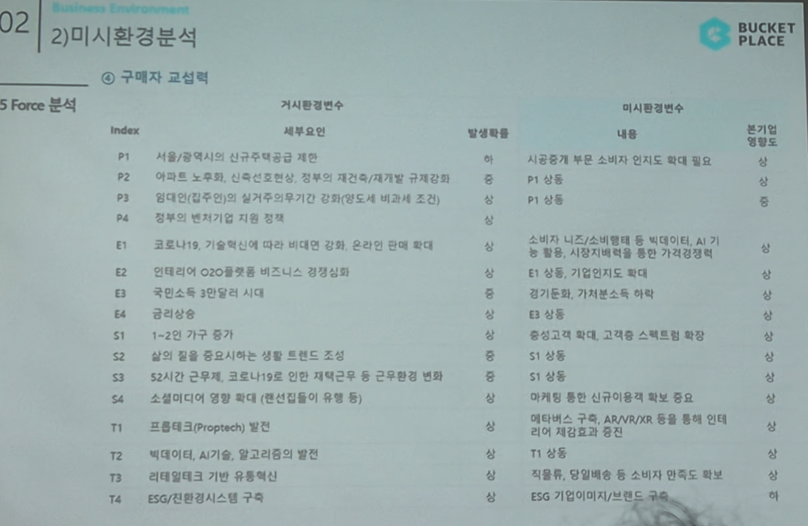

# Page 26 — 미시환경 분석: 5 Force - 구매자 교섭력

## 섹션: 02 Business Environment > 2) 미시환경분석

## 5 Force 분석 - ④ 구매자 교섭력

### 거시환경변수 → 미시환경변수 매핑

| Index | 세부요인 | 발생확률 | 미시환경변수 내용 | 분기별 영향도 |
|-------|--------|---------|---------------|-----------|
| P1 | 서울/광역시의 신규주택공급 제한 | 중 | 시공중개 부문 소비자 인지도 확대 필요 | - |
| E1 | 코로나19, 기술혁신 비대면 강화 | 상 | 소비자 니즈/소비영향 등 빅데이터, AI 기능 활용, 시장지배력을 통한 교섭 | - |
| E2 | 인테리어 O2O플랫폼 비즈니스 경쟁심화 | 상 | 이용 중, 기업간 이동비용 하락 | - |
| E3 | 국민소득 3만달러 시대 | - | 금전능력 향상, 가치(소비)로 확대 | - |
| S1 | 1~2인 가구 증가 | - | 실질고객 확대, 고객수요 스펙트럼 확장 | S1 상동 |
| S3 | 52시간 근무제, 코로나19를 인한 재택근무 등 근무환경 변화 | - | - | - |
| S4 | 소셜미디어 영향 확대 (랜선집들이 유행 등) | - | 마케팅 활용, 신규이용자 확보가 중요 | - |
| T1 | 프롭테크(Proptech) 발전 | - | 메타버스 구축, AR/VR/XR 등을 통해 인테 리어 경험 확대 | T1 상동 |
| T2 | 빅데이터, AI기술, 알고리즘의 발전 | - | - | - |
| T3 | 리테일테크 기반 유통혁신 | - | 이물류/배송, 일일배송 대응 등 소비자 편의 강화 | - |
| T4 | ESG/친환경시스템 구축 | - | ESG 기업이미지/브랜드 구축 | - |

## 핵심 분석
- **구매자(소비자) 교섭력 상승 추세**
- 1~2인 가구 증가로 실질 고객 확대, 고객 수요 스펙트럼 다양화
- 빅데이터/AI를 통한 개인화 추천으로 구매자 만족도 향상 필요
- 메타버스/AR/VR 등 신기술을 통한 인테리어 경험 혁신이 구매자 교섭력 대응 핵심
- 물류/배송 역량 강화, ESG 브랜드 이미지 구축도 중요 과제
