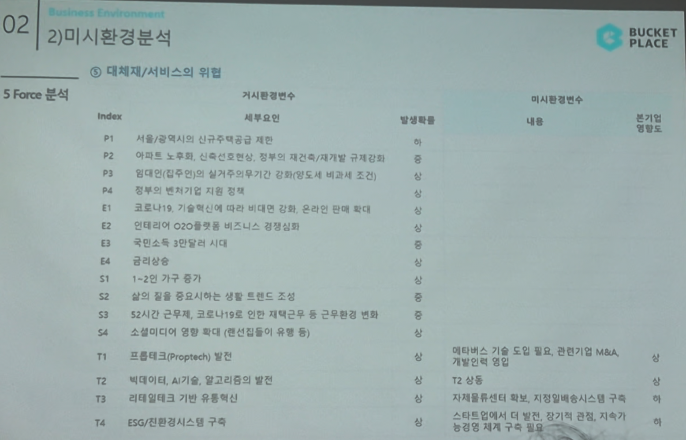

# Page 27 — 미시환경 분석: 5 Force - 대체재/서비스의 위협

## 섹션: 02 Business Environment > 2) 미시환경분석

## 5 Force 분석 - ⑤ 대체재/서비스의 위협

### 거시환경변수 → 미시환경변수 매핑

| Index | 세부요인 | 발생확률 | 미시환경변수 내용 | 분기별 영향도 |
|-------|--------|---------|---------------|-----------|
| P1 | 서울/광역시의 신규주택공급 제한 | 중 | - | - |
| P2 | 아파트 노후화, 신축건축 감소 | 중 | - | - |
| E2 | 인테리어 O2O플랫폼 비즈니스 경쟁심화 | 상 | - | - |
| S3 | 52시간 근무제, 코로나19로 인한 재택근무 등 근무환경 변화 | - | - | - |
| S4 | 소셜미디어 영향 확대 (랜선집들이 유행 등) | - | - | - |
| T1 | 프롭테크(Proptech) 발전 | - | 액티비즈 기술 도입 필요, 관련기관 M&A, 개발인력 확충 | - |
| T2 | 빅데이터, AI기술, 알고리즘의 발전 | - | T2 상동 | - |
| T3 | 리테일테크 기반 유통혁신 | - | 자체물류센터 확보, 자체배송 시스템 구축 유지 | - |
| T4 | ESG/친환경시스템 구축 | - | 스타트업으로서 ESG에 대한 자가 투자 능력/경험 제작 구축 필요 | - |

## 핵심 분석
- **대체재/서비스 위협 중간~상 수준**
- 프롭테크 기술 발전으로 대체 서비스 등장 가능성 존재
- 자체 물류센터 확보, 자체배송 시스템 구축으로 대응
- 액티비즈 기술 도입 및 관련 기관 M&A를 통한 기술력 확보 필요
- ESG 관련 투자/구축도 스타트업으로서 과제
