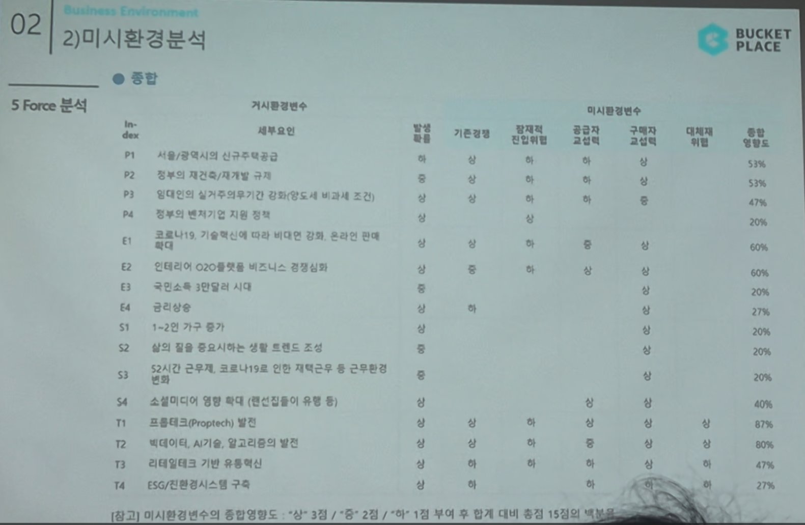

# Page 28 — 미시환경 분석: 5 Force 종합

## 섹션: 02 Business Environment > 2) 미시환경분석

## 5 Force 분석 종합표

| Index | 세부요인 | 기존경쟁자 | 잠재적진입자 | 공급자 교섭력 | 구매자 교섭력 | 대체재 위협 | 본기업 영향도 |
|-------|--------|---------|---------|---------|---------|---------|---------|
| P1 | 서울/광역시의 신규주택공급 | V | V | V | V | - | 57% |
| P2 | 정부의 재건축/재개발 규제 | V | - | - | - | - | 57% |
| P3 | 임대인(집주인)의 실거주의무기간 강화(양도세 비과세 조건) | V | V | V | - | - | 47% |
| P4 | 정부의 벤처기업 지원 정책 | - | - | - | - | - | 20% |
| E1 | 코로나19, 기술혁신에 따라 비대면 강화, 온라인 판매 확대 | V | V | V | V | - | 60% |
| E2 | 인테리어 O2O플랫폼 비즈니스 경쟁심화 | V | V | V | V | V | 77% |
| E3 | 국민소득 3만달러 시대 | - | - | - | V | - | 20% |
| E4 | 금리상승 | - | - | - | - | - | - |
| S1 | 1~2인 가구 증가 | - | - | - | V | - | 20% |
| S2 | 삶의 질을 중요시하는 생활 트렌드 조성 | - | - | - | V | - | 53% |
| S3 | 52시간 근무제, 코로나19로 인한 재택근무 등 근무환경 변화 | - | - | - | - | V | 20% |
| S4 | 소셜미디어 영향 확대 (랜선집들이 유행 등) | - | - | - | V | - | 87% |
| T1 | 프롭테크(Proptech) 발전 | V | V | V | V | V | 87% |
| T2 | 빅데이터, AI기술, 알고리즘의 발전 | V | V | V | V | V | 60% |
| T3 | 리테일테크 기반 유통혁신 | - | V | V | V | V | 47% |
| T4 | ESG/친환경시스템 구축 | - | - | V | V | V | 27% |

> [참고] 미시환경변수의 종합영향도: "상" 3점 / "중" 2점 / "하" 1점 부여 이후 합계 대비 총점 15점의 비율(%)
