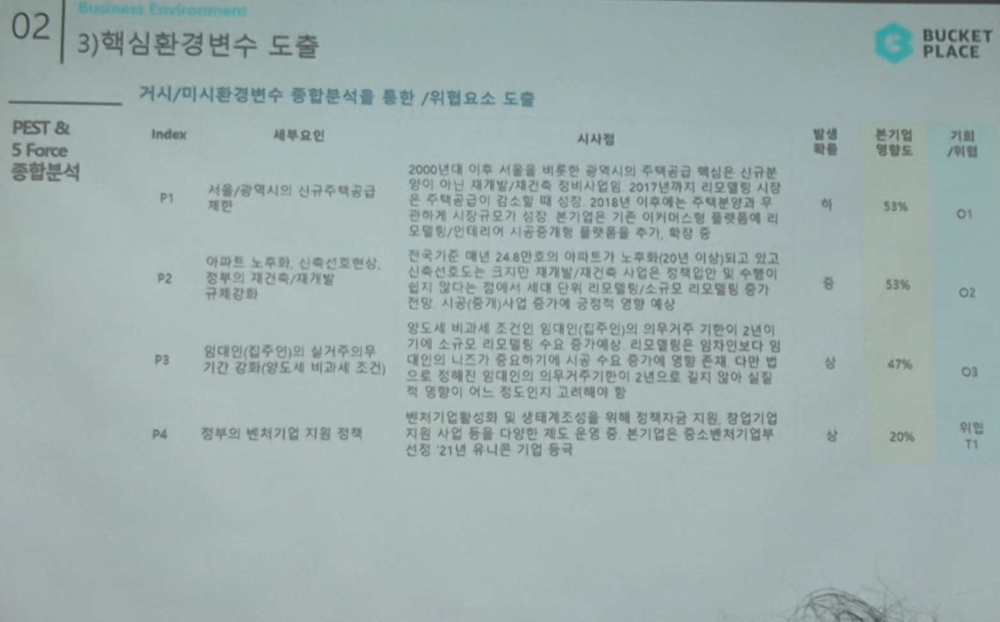

# Page 29 — 핵심환경변수 도출 (P1~P4)

## 섹션: 02 Business Environment > 3) 핵심환경변수 도출

## PEST & 5 Force 종합분석 → 기회/위협 도출

### 정치적 요인 (P)

| Index | 세부요인 | 시사점 | 발생확률 | 본기업 영향도 | 기회/위협 |
|-------|--------|--------|---------|---------|---------|
| P1 | 서울/광역시의 신규주택공급 제한 | 2000년대 이후 서울을 비롯한 광역시의 주택공급 핵심은 신규분양이 아닌 재개발/재건축으로 전환. 리모델링 시장 확대에 따른 인테리어 수요 증대. 오늘의집 입장에서 기존 시공중개 서비스 확장 기회 | 하 | 53% | O1 |
| P2 | 아파트 노후화, 신축건축 감소, 정부의 재건축/재개발 규제강화 | 한국은 대비 24.8건으로 아파트가 노후화(20년 이상)되고 있고, 신규건축이 크게 줄면서 리모델링/재건축 시장은 확대될 전망. 인테리어 수요 증가 기회 | 중 | 53% | O2 |
| P3 | 임대인(집주인)의 실거주의무기간 강화(양도세 비과세 조건) | 임대인의 실거주의무기간 강화로 인테리어 니즈가 확장되어 시공 수요 증가여 확대 가능. 다만 다양한 전세 제도 변화로 유동적 | 중 | 47% | O5 |
| P4 | 정부의 벤처기업 지원 정책 | 벤처기업확인서 및 상품과 조성을 위해 정책자금 지원, 정부인증 등 지원 사업 등 다양한 제도 운영 및 본 기업은 중소벤처기업부 선정 21년 유니콘 기업 달성 | 상 | 20% | 위협 T1 |
