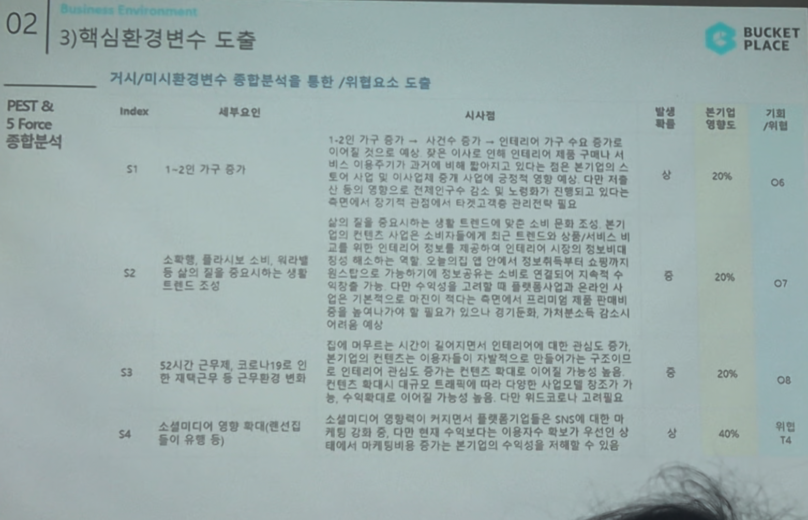

# Page 30 — 핵심환경변수 도출 (S1~S4)

## 섹션: 02 Business Environment > 3) 핵심환경변수 도출

## PEST & 5 Force 종합분석 → 기회/위협 도출

### 사회적 요인 (S)

| Index | 세부요인 | 시사점 | 발생확률 | 본기업 영향도 | 기회/위협 |
|-------|--------|--------|---------|---------|---------|
| S1 | 1~2인 가구 증가 | 1~2인 가구 증가 → 시간수 증가 → 인테리어 가구 수요 증가로 이에 맞춰 인테리어 합리적 소비 수요 상승. 이사 및 인테리어 중개 시업에 긍정적 영향. 분기별 이사가 잦은 1~2인 가구의 특성상 인테리어 관련 시장 확대 | 상 | 20% | O6 |
| S2 | 소확행, 홈퍼니싱 트렌드 조성 | 삶의 질을 중시하는 소비 트렌드에 맞춰 조닝 및 본인만의 편안한 공간 만들기 트렌드. 인테리어 상품/서비스 소비 확대. 컨텐츠 소비 또한 증가. 온라인 컨텐츠에 활발한 관심이 지속적으로 확대될 것으로 보이나 이에 따른 운영비의 기저효과 → 장기적으로 가치분산도 감소/시 이용도 예상 | 중 | 20% | O7 |
| S3 | 52시간 근무제, 코로나19로 인한 재택근무 등 근무환경 변화 | 집에 머무르는 시간 증가 → 인테리어 관심도 증가 → 컨텐츠 확대 → 이용자 증가로 시장 확대. 대규모 오프라인 매장 대비 온라인 마켓에서의 트래픽 증가가 수원래대로 이어지면 본기업의 수익구조에 더 긍정적 | 상 | 40% | O8 위협 T4 |
| S4 | 소셜미디어 영향 확대 (랜선집들이 유행 등) | 소셜미디어 영향력 증가와 인테리어 관련 콘텐츠 유통 증가가 SNS에 입소문 마케팅 강화. 다만 마케팅에 비용이 가는 수지균형을 유지해야 하며 마케팅에 많은 투자는 기업의 수익구조 및 수현구조 감소 유발 | 상 | 40% | 위협 T4 |
