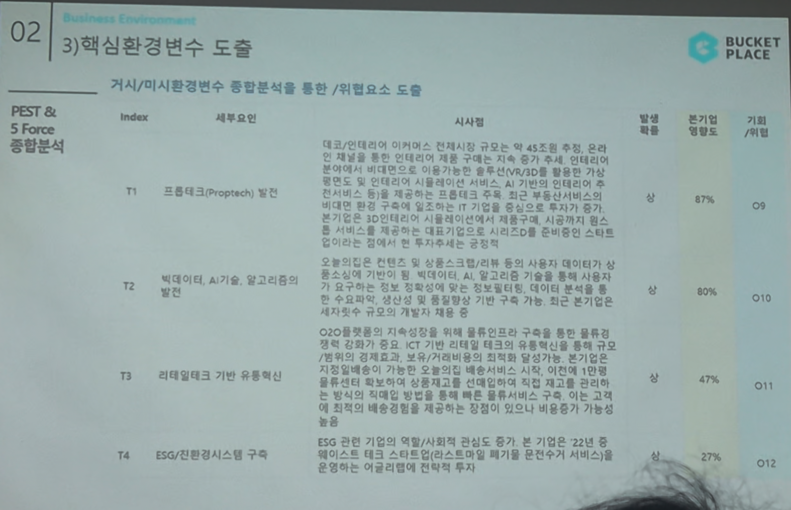

# Page 31 — 핵심환경변수 도출 (E1~E4, T1~T4)

## 섹션: 02 Business Environment > 3) 핵심환경변수 도출

## PEST & 5 Force 종합분석 → 기회/위협 도출

### 경제적 요인 (E) + 기술적 요인 (T)

| Index | 세부요인 | 시사점 | 발생확률 | 본기업 영향도 | 기회/위협 |
|-------|--------|--------|---------|---------|---------|
| T1 | 프롭테크(Proptech) 발전 | 대표 인테리어 이커머스 컨텐츠 기업으로서 매도적 트렌드 확장. 인테리어 분야에 구매 시 기존 가구 추세 변화에 맞춘 AR/VR/3D 모델링 등의 프롭테크 도입 기회. 최근 부동산서비스까지 확대를 시도. 제공하는 다양한 서비스에 프롭테크 기술 접목으로 시리즈D를 운영하면 스타트업으로 경쟁에서 한 단계 투자상의 진전을 이루어야 할 시점 | 상 | 87% | O9 |
| T2 | 빅데이터, AI기술, 알고리즘의 발전 | 인테리어 분야에서 빅데이터/AI 기반 큐레이션 역량이 핵심. 사용자 니즈에 맞는 맞춤형 상품/서비스 제공이 가능한 빅데이터 분석력과 AI 수요기반 추천 알고리즘이 핵심 경쟁력 | 상 | 60% | O10 |
| T3 | 리테일테크 기반 유통혁신 | O2O 플랫폼의 지속 성장을 위해 컨텐츠의 구축을 통한 현장감 증가 및 ICT 부문 리테일과 기술 접목 강화. 보수/가구배치 전문/설비 확보 → 시공 구조를 통한 전체 인테리어 서비스 가치 이동 기대 | 상 | 47% | O11 |
| T4 | ESG/친환경시스템 구축 | ESG 관련 기업의 역할/사회적 관심도 증가. 본 기업은 21년도 해리스트 대표 스타트업(인사이트앱 페기물 온전거치 서비스 등)으로 선정. 관련 윤리경영 투자 기대 | 상 | 27% | O12 |
