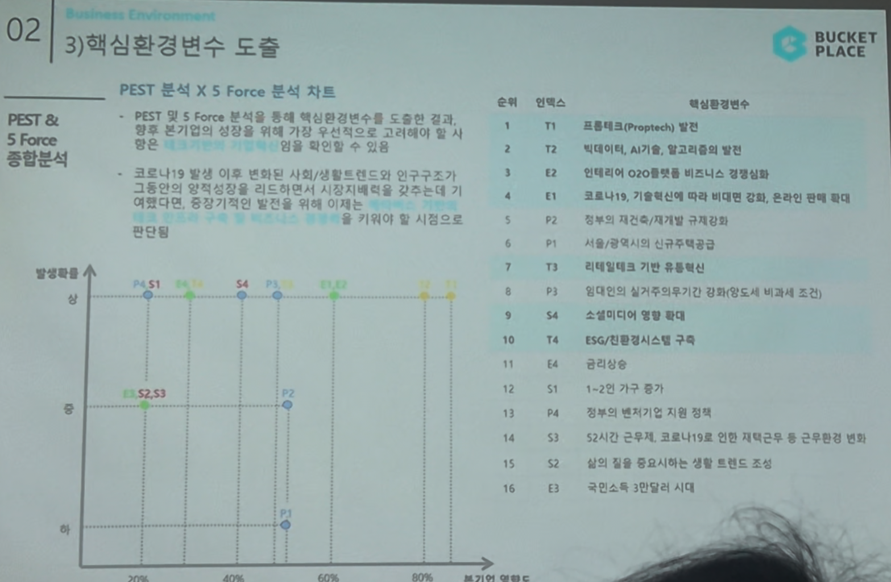

# Page 32 — 핵심환경변수 도출: PEST x 5 Force 매트릭스 종합

## 섹션: 02 Business Environment > 3) 핵심환경변수 도출

## PEST 분석 X 5 Force 분석 종합 차트

### 우선순위 (발생확률 × 본기업 영향도 기준)

| 순위 | Index | 핵심환경변수 |
|------|-------|-----------|
| 1 | T1 | 프롭테크(Proptech) 발전 |
| 2 | T2 | 빅데이터, AI기술, 알고리즘의 발전 |
| 3 | E2 | 인테리어 O2O플랫폼 비즈니스 경쟁심화 |
| 4 | E1 | 코로나19, 기술혁신에 따라 비대면 강화, 온라인 판매 확대 |
| 5 | P2 | 정부의 재건축/재개발 규제 강화 |
| 6 | T3 | 리테일테크 기반 유통혁신 |
| 7 | P3 | 임대인의 실거주의무기간 강화(양도세 비과세 조건) |
| 8 | S4 | 소셜미디어 영향 확대 |
| 9 | T4 | ESG/친환경시스템 구축 |
| 10 | E4 | 금리상승 |
| 11 | S1 | 1~2인 가구 증가 |
| 12 | P4 | 정부의 벤처기업 지원 정책 |
| 13 | S3 | 52시간 근무제, 코로나19로 인한 재택근무 등 근무환경 변화 |
| 14 | S2 | 삶의 질을 중요시하는 생활 트렌드 조성 |
| 15 | P1 | 서울/광역시의 신규주택공급 제한 |
| 16 | E3 | 국민소득 3만달러 시대 |

## 분석 요약
- **코로나19 발생 이후 변화된 사회/생활트렌드 및 인구구조가 크게 변화**하면서 플랫폼 비즈니스 경쟁심화가 진행 중
- **프롭테크(T1)와 빅데이터/AI(T2)**가 가장 높은 영향도 → 기술 키워드가 핵심
- 발생확률과 본기업 영향도 판단결과, 향후 본기업의 성장을 위해 가장 우선적으로 고려해야 할 핵심환경변수임을 확인할 수 있음
- 발생확률 × 영향도 매트릭스에서 **우상단(높은 확률 + 높은 영향)** 영역에 T1, T2, E2, E1이 위치 → 을 키워야 할 시장으로 판단
