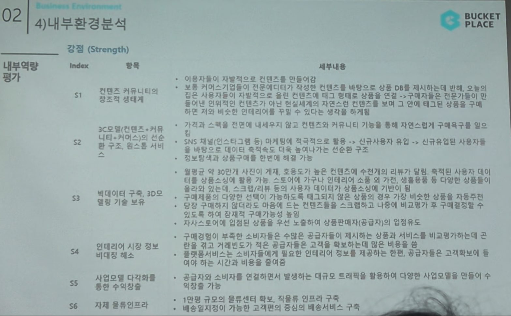

# Page 33 — 내부환경분석: 강점 (Strength)

## 섹션: 02 Business Environment > 4) 내부환경분석 (내부역량평가)

## 강점 (Strength)

| Index | 항목 | 세부내용 |
|-------|------|---------|
| S1 | 컨텐츠 커뮤니티의 창조적 생태계 | 이용자들이 자발적으로 컨텐츠를 만들어감. 보통 커머스기업들이 직접 컨텐츠를 만들어야 하는 것과 달리, 사용자 기반 UGC가 자연스럽게 상품 DB에 제시되며 타인의 인테리어 컨텐츠를 통해 다른 사용자들의 구매를 견인. 비용 없이 다른 인테리어 플랫폼 대비 주목도가 높음 |
| S2 | 3C모델(컨텐츠·커뮤니티·커머스)의 선순환 구조, 원스톱 서비스 | 가격과 스펙을 전면에 내세우지 않고 컨텐츠의 커뮤니티 기능을 통해 자연스러운 구매욕구 발생 → 신규이용자 증가 & 사용시간 확대 → 선순환 구조 보유 |
| S3 | 빅데이터 구축, 3D모델링 기술 보유 | 월로우 약 3만만 사진의 게재, 높은 트래픽으로 높은 컨텐츠 수전(5B)의 비례적 축적된 사용자 데이터를 보유. 이를 기반으로 한 빅데이터 분석 및 3D 모델링 기술(아키드로우) 확보 |
| S4 | 인테리어 시장 정보 비대칭 해소 | 구매정보가 부족한 소비자에게 수준높은 제시하여 상품과 서비스를 비교가능하게 하고, 전문 업체를 비교하고 구매 결정까지 연결 |
| S5 | 사업모델 다각화를 통한 수익구조 다변화 | 공급자와 소비자를 연결하면서 발생하는 트래픽의 활용하에 다양한 사업다각화를 진행 중 |
| S6 | 자체 물류인프라 및 배송서비스 구축 | 이천에 자체 물류센터(JK물류센터) 구축 → 고객만의 중심의 배송서비스 구축 |
