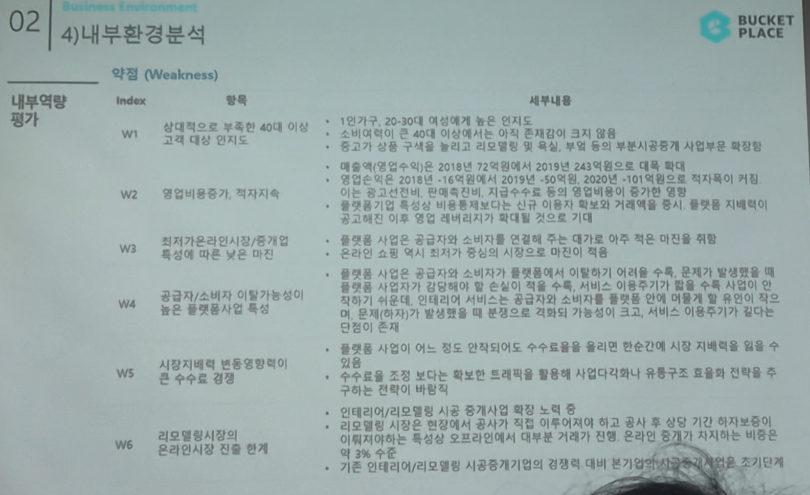

# Page 34 — 내부환경분석: 약점 (Weakness)

## 섹션: 02 Business Environment > 4) 내부환경분석 (내부역량평가)

## 약점 (Weakness)

| Index | 항목 | 세부내용 |
|-------|------|---------|
| W1 | 고객 대상 인지도 부족 (한정적으로 젊은 40대 이하 고객 대상) | 1인가구, 20~30대 대상에게 높은 인지도를 보유하나, 전체 인테리어 시장 대비 본사 주 타겟인 젊은 40대 이하 고객 대상의 인테리어 시장은 전체 시공/중개 사업의 일부 |
| W2 | 영업비용증가, 적자지속 | 매출(영업수익)은 2018년 72억원에서 2015년 243억원으로 매출 확대되었지만, 영업비용 또한 2018년 16억원에서 2019년 50억원, 2020년 101억원으로 적자폭이 지속적으로 확대. 마케팅 비용 중심의 적자구조 |
| W3 | 최저가 보장 혹은 차별화 아직 미비 | 종합플랫폼 사업군에서의 소비자 충성도가 아직 대기업에 비해 뒤처지는 위험 존재. 컨텐츠 소비와 실제 커머스 사이의 전환율 개선 과제 |
| W4 | 공급자/소비자 이탈가능성이 높은 플랫폼사업 특성 | 플랫폼 사업 특성상 공급자/소비자의 이탈 억제를 위해 수익 감소, 운영 가치 발생가능성 존재. 본 회사에서 발생하는 수익에 전적인 의존 가능성이 크고, 서비스 추가투자가 가능한 여건 관리 필요 |
| W5 | 시장지배력 변동에 따른 수수료 경쟁 | 플랫폼 사업이 이룩. 정도 단합되어도 수수료를 올리면 시장 지배력이 약화되는 사업구조 → 수수료 수준 조정 제한적 |
| W6 | 리모델링시장/시공 분야 온라인시장 진출 제한 | 인테리어/리모델링 시공 분야는 온라인으로 완전히 전환하기 어려운 영역. 오프라인 연계가 필수적이며 기존 인테리어/리모델링 시공중개기업의 경쟁에 대한 본 기업의 시공중개 사업은 초기단계 |
