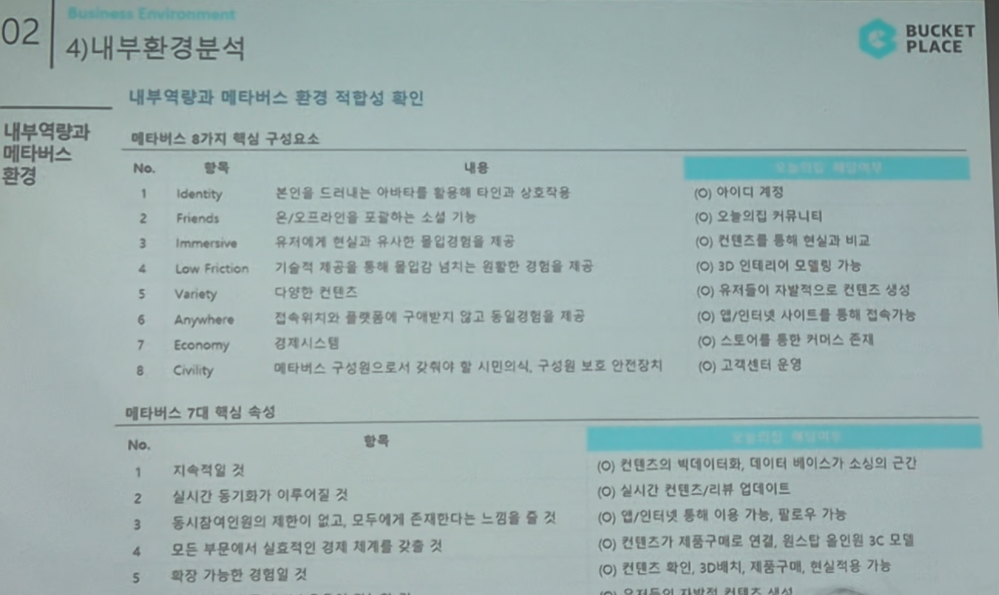

# Page 35 — 내부환경분석: 메타버스 환경 적합성 확인

## 섹션: 02 Business Environment > 4) 내부환경분석 (내부역량평가)

## 내부역량과 메타버스 환경 적합성 확인

### 메타버스 8가지 핵심 구성요소와 오늘의집 적합도

| No. | 항목 | 내용 | 적합도 |
|-----|------|------|--------|
| 1 | Identity | 본업을 드러내는 아바타를 활용해 타인과 상호작용 | (O) 아이디 개발 |
| 2 | Friends | 오/오프라인을 움직이는 소셜 기능 | (O) 오늘의집 커뮤니티 |
| 3 | Immersive | 유저에게 현실과 유사한 몰입감(실감형) 제공 | (O) 컨텐츠로 해서 현실과 비교 |
| 4 | Low Friction | 기술적 제공을 통해 불편감 상시적 전환된 경험을 제공 | (O) 3D 인테리어 모델링 기능 |
| 5 | Variety | 다양한 컨텐츠 | (O) 유저참여 기반하여 컨텐츠 상시 업데이트 |
| 6 | Anywhere | 접속위치와 플랫폼의 구애받지 않고 동일(정합)정보 | (O) 앱/인터넷 사이트를 통한 접속 가능 |
| 7 | Economy | 경제시스템 | (O) 스토어에 통한 커머스 존재 |
| 8 | Civility | 메타버스 구조론으로서 사회적 시민의식, 구성원 보호·안전관리 | (O) 고객관리 역할 |

### 메타버스 7대 핵심 속성과 오늘의집 적합도

| No. | 속성 | 적합도 |
|-----|------|--------|
| 1 | 기야가의 빅데이터화, 에디터 베이스가 수입의 근간 | (O) 컨텐츠의 빅데이터화 |
| 2 | 실시간 등기화가 이루어질 것 | (O) 실시간 컨텐츠의 사용이 가능 |
| 3 | 동시참여인원의 제한이 없고, 모두에게 존재한다는 느낌을 줄 것 | (O) 컨텐츠 제공 기능 |
| 4 | 모든 부분에서 실질적인 경제 체계를 갖출 것 | (O) 컨텐츠가 시장 트래픽의 근간 |
| 5 | 확장 가능한 경험을 줄 것 | (O) 컨텐츠 확대, 3D배치, 재물구입, 연동 가능 |

## 핵심 분석
- 오늘의집은 메타버스의 8가지 핵심 구성요소와 7대 핵심 속성에 대부분 적합
- 이미 보유한 UGC 컨텐츠, 커뮤니티, 커머스, 3D 모델링 기능이 메타버스 전환의 기반
- 향후 AR/VR/XR 기술 접목 시 메타버스 인테리어 플랫폼으로 진화 가능성 높음
