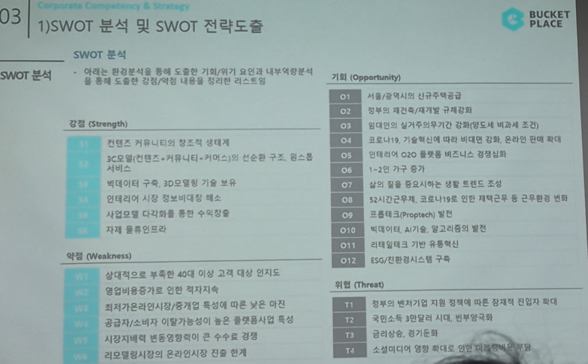

# Page 37 — SWOT 분석 및 SWOT 전략도출: SWOT 분석 종합

## 섹션: 03 Corporate Competency & Strategy > 1) SWOT 분석 및 SWOT 전략도출

## SWOT 분석 종합

### 강점 (Strength)
| Index | 항목 |
|-------|------|
| S1 | 컨텐츠 커뮤니티의 창조적 생태계 |
| S2 | 3C모델(컨텐츠·커뮤니티·커머스)의 선순환 구조, 원스톱 서비스 |
| S3 | 빅데이터 구축, 3D모델링 기술 보유 |
| S4 | 인테리어 시장 정보 비대칭 해소 |
| S5 | 사업모델 다각화를 통한 수익구조 다변화 |
| S6 | 자체 물류인프라 |

### 약점 (Weakness)
| Index | 항목 |
|-------|------|
| W1 | 상대적으로 부족한 40대 이상 고객 대상 인지도 |
| W2 | 영업비용증가로 인한 적자지속 |
| W3 | 최저가 보장/차별화 미비 |
| W4 | 공급자/소비자 이탈가능성이 높은 플랫폼사업 특성 |
| W5 | 시장지배력 변동에 따른 수수료 경쟁 |
| W6 | 리모델링시장의 온라인시장 진출 제한 |

### 기회 (Opportunity)
| Index | 항목 |
|-------|------|
| O1 | 서울/광역시의 신규주택공급 제한 |
| O2 | 정부의 재건축/재개발 규제 |
| O3 | 정부의 실거주의무기간 강화(양도세 비과세 조건) |
| O4 | 코로나19, 기술혁신에 따라 비대면 강화, 온라인 판매 확대 |
| O5 | 인테리어 O2O 플랫폼 비즈니스 경쟁심화 |
| O6 | 1~2인 가구 증가 |
| O7 | 삶의 질을 중요시하는 생활 트렌드 조성 |
| O8 | 52시간 근무제, 코로나19로 인한 재택근무 등 근무환경 변화 |
| O9 | 프롭테크(Proptech) 발전 |
| O10 | 빅데이터, AI기술, 알고리즘의 발전 |
| O11 | 리테일테크 기반 유통혁신 |
| O12 | ESG/친환경시스템 구축 |

### 위협 (Threat)
| Index | 항목 |
|-------|------|
| T1 | 정부의 벤처기업 지원 정책에 따른 경쟁사 진입 확대 |
| T2 | 국민소득 3만달러 시대, 비중확대 |
| T3 | 금리상승, 자기조달 비용 증가 |
| T4 | 소셜미디어 영향 확대로 인한 마케팅비용 증가 (W/W) |
