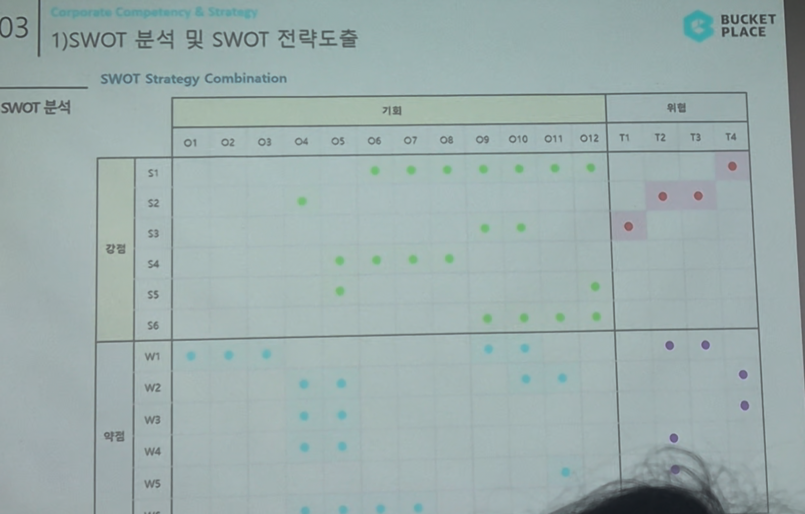

# Page 38 — SWOT Strategy Combination 매트릭스

## 섹션: 03 Corporate Competency & Strategy > 1) SWOT 분석 및 SWOT 전략도출

## SWOT Strategy Combination 매트릭스

### 강점(S) × 기회(O) 교차 분석
- S1~S6 각 강점이 O1~O12 기회와 교차하는 지점을 도트로 표시
- **S1(UGC 생태계)**이 가장 많은 기회 항목과 연결 (O1~O12 대부분)
- **S2(3C 선순환 구조)**도 다수의 기회와 연결

### 강점(S) × 위협(T) 교차 분석
- S1이 T1, T2, T3와 교차 → UGC 생태계가 위협 대응의 핵심
- S3(빅데이터/3D)가 T2와 교차

### 약점(W) × 기회(O) 교차 분석
- W1~W6이 일부 기회 항목과 교차 → 약점 보완 전략 도출 지점

### 약점(W) × 위협(T) 교차 분석
- W2(적자지속)와 T3(금리상승) 등이 교차 → 재무구조 개선이 핵심 과제

## 핵심 시사점
- SO전략(강점+기회): 가장 많은 교차점 → 공격적 성장 전략 가능
- ST전략(강점+위협): UGC와 빅데이터로 위협 방어
- WO전략(약점+기회): 약점 보완을 통한 기회 활용
- WT전략(약점+위협): 방어적 전략 필요
