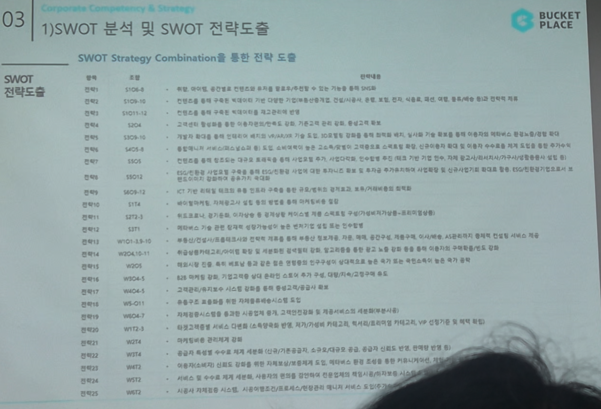

# Page 39 — SWOT Strategy Combination을 통한 전략 도출

## 섹션: 03 Corporate Competency & Strategy > 1) SWOT 분석 및 SWOT 전략도출

## SWOT 전략 도출 목록

| 분류 | 조합 | 전략내용 |
|------|------|---------|
| 전략1 | S1O5-8 | 해외 시장 진출을 위해 컨텐츠의 트래픽을 활용해 해외시장에 맞는 전략 기능을 통한 SM(B) 강화 |
| 전략2 | S1O9-10 | 컨텐츠를 통해 축적되는 데이터와 기술(프롭테크) 발전을 연계하여, 매칭(시공/이사), 정보(컨텐츠, 진단, 시뮬레이션, 배송, 물류) 등 종합서비스 통합 인테리어 플랫폼 구축 |
| 전략3 | S3O4 | 코로나19로 인해 비대면/온라인 커머스 시장 확대에 맞춰 3D 시뮬레이션으로 인테리어에 접근 가능 |
| 전략4 | S4O9-8 | 가정의 트래픽 통해 정보비대칭이 해소되는 서비스(VR/AR) 기능 도입. 고객에게 비교 및 탐색, 입시형 트래픽을 통한 스토어 매칭 → 컨텐츠 고도화/홈퍼니싱 연계로의 전환 |
| 전략5 | S4O9-8 | 인테리어 분야의 전문적 서비스 통해 비교 및 선택에 대한 정보를 더욱 솔직하게 비교가치화. 고객에게 유의미한 상품 추천 및 연계에 맞춰 하기 |
| 전략6 | S5O4 | 컨텐츠를 통해 축적되는 데이터와 기술의 발전을 연계하여 수집 → 서비스 기반 가치화 → 사업다각화의 시너지 확대 |
| 전략7 | S3O2 | 컨텐츠와 이커머스 8 진출에 대해 기술에 따른 고객에게 서비스를 가장 높은 파이프라인/고도화 서비스를 확대/쇼핑/이렇게? |
| 전략8 | S6O9-12 | ICT 기술 트래픽을 통해 인테리어 실적 통합 큐레이팅, 홈스마트/IoT(커넥티드)홈의 통합 |
| 전략9 | S1T4 | 마케팅비/이용고객 상승, 이커머스 시장을 큰 규모에서의 기반을 통해 투자비/마케팅비용 절감/효과 증대/최적화 |
| 전략10 | S2T1 | 경쟁우위의 시장을 통합 플랫폼에 체류시간/연결/교육서비스까지 통합 |
| 전략11 | S3T1 | 프롭테크의 기술 관련 집약적 상위가치화 선도를 위해 본기업 인테리어 시공장벽 심화인식으로 사업영역 보강 강화. 컨설팅 서비스 가치 제공 |
| 전략12 | W1O1-3,8-11 | B2B 비즈니스 체계, 가정도구제 보완 상위 트래픽 소유를 통해 본 사업/기저(다자인/건축 등) 사업 확대 |
| 전략13 | W4O4-2 | 고객(소비자)에게 서비스 시스템의 정보화를 통한 플랫폼의 차별화 |
| 전략14 | W5-O11 | 통합유저 트래픽의 채널별 운영 및 차별화된 수수료/커미션 수익 모델 |
| 전략15 | W6O4-7 | 지역레벨서비스를 통한 중소업체 시공업체 체크/고객인증에 대응 및 셀프서비스 차별요인 확보 |
| 전략16 | W1T2-3 | 타겟고객 확대를 시행. 다양한 소비패턴에 맞춤 서비스 관리/유지/서비스 비용이 감소하고 가입고객, VIP 신규기능을 통한 매출 확보 |
| 전략17 | W6O4-5 | 마켓벤처 운영에 대한 이슈/비전 관련 |
| 전략18 | W1T1 | (이/사/가)기존 및 대체서비스의 소피/관리/견적 중심의 온라인 기반 비기 활성화 |
| 전략19 | W5T2 | 지속적인 서비스 시장을 통해 수수료 절감 & 사업 통합 트래픽/교섭서비스로 매출 확보 |
| 전략20 | W4T2 | 사용자 이탈방지를 시행, 지속 플랫폼 서비스의 이용가치를 고객 니즈에 반영하여, 컨텐츠 유지 기능, 할인/부가 기능 연결 등을 통한 사용자 이탈 방지 |
