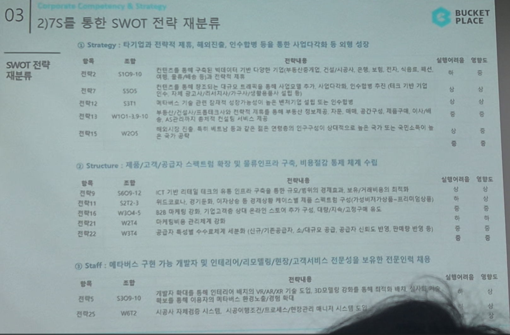

# Page 40 — 7S를 통한 SWOT 전략 재분류 (Strategy, Structure, Staff)

## 섹션: 03 Corporate Competency & Strategy > 2) 7S를 통한 SWOT 전략 재분류

## McKinsey 7S 프레임워크로 SWOT 전략 재분류

### ① Strategy: 타기업과 전략적 제휴, 해외진출, 인수합병 등을 통한 사업다각화 및 외형 성장

| 항목 | 조합 | 전략내용 | 실행여부/진행도 |
|------|------|---------|------------|
| 전략1 | S1O9-10 | 컨텐츠를 통해 구축한 플랫폼에 디양한 서비스(시공/이사/인테리어, 정보(컨텐츠, 진단, 시뮬레이션, 배송, 물류) 등 종합 서비스 통합 인테리어 플랫폼 확대 가능 | 일부 진행 |
| 전략2 | S3O5 | 컨텐츠를 통해 인테리어 비교/분석 서비스를 기반으로 시용자/가구 결합을 진행. 다양한 컨텐츠를 통한 전략적 확대 | 진행 중 |
| 전략11 | S3T1 | 해외시장 기술 관련 인테리어 도입을 위해 통합서비스를 높이고 해외로의 진출을 위한 수요 기반 플랫폼 확대 | 일부 진행 |
| 전략E1 | W1O1-3,8-10 | 비즈니스(시공/인테리어) 관련 B2B 사업을 높이고 부동산 시세는 인테리어/시공 분야의 컨텐츠/서비스 기반 확장 | 일부 진행 |
| 전략E11 | W3O4 | - | - |

### ② Structure: 제품/고객/공급자 스펙트럼 확대 및 물류인프라 구축, 비용절감 통한 재계 수입

| 항목 | 조합 | 전략내용 | 실행여부/진행도 |
|------|------|---------|------------|
| 전략8 | S6O9-12 | ICT 기반 리테일테크 활용한 컨텐츠 구축을 통한 트래픽 증가/기반시장 확보 | 일부 진행 |
| 전략9 | S1T2-3 | - | - |
| 전략12 | W1O4-5 | B2B 비즈니스 고도화와 고객사 기존 구매 대응/시뮬레이션/AR/3D구축 등 사업 확대 | 일부 진행 |
| 전략13 | W2O4 | 마케팅비용 관련체계 적립 | 일부 진행 |
| 전략22 | W3T4 | 디자인/트렌드공간 큐레이팅, 소셜(큐라 공간, 공간인 코팅) 등의 신규 미래 서비스 구축 | - |

### ③ Staff: 메타버스 구현 가능 개발자 및 인테리어/리모델링/편집/고객서비스 전문성을 보유한 전문인력 채용

| 항목 | 조합 | 전략내용 | 실행여부/진행도 |
|------|------|---------|------------|
| 전략3 | S3O9-10 | 가정의 트래픽을 통해 인테리어 메타버스 VR/AR/XR 기술 도입, 3D모델링 컨텐츠와 기술을 제공 및 이용/플랫폼(B2B/B2C) 연계 | - |
| 전략15 | W5T2 | 시공시 시뮬레이션 시스템, 시공(유)엔진 프레이밍/이용가치/영상갤러리 등 연동 | - |
