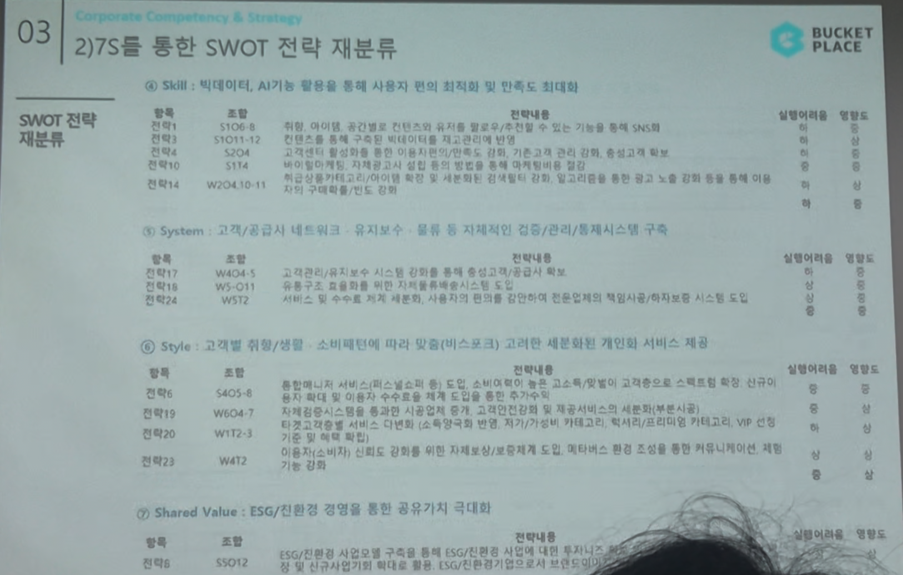

# Page 41 — 7S를 통한 SWOT 전략 재분류 (Skill, System, Style, Shared Value)

## 섹션: 03 Corporate Competency & Strategy > 2) 7S를 통한 SWOT 전략 재분류

### ④ Skill: 빅데이터, AI기능 활용을 통해 사용자 최적화 및 인지도 확대

| 항목 | 조합 | 전략내용 | 실행여부/진행도 |
|------|------|---------|------------|
| 전략4 | S1O1-12 | 컨텐츠를 통해 인테리어 상품 추천, 트래픽 유도, 사용자 데이터 수집과 연계하여 UGC 시장 확대 | 일부 진행 |
| 전략5 | S2O4 | - | - |
| 전략6 | S1T4 | - | - |
| 전략14 | W5O4-10-11 | - | - |

### ⑤ System: 고객/공급자 네트워크 유지보수·물류 등 자체적인 전품/관리/통제시스템 구축

| 항목 | 조합 | 전략내용 | 실행여부/진행도 |
|------|------|---------|------------|
| 전략7 | W5O4-8 | 고객관계관리 시스템 및 B2B, 마켓 및 인테리어 비즈니스의 자체적 고도화/통합 관리 | - |
| 전략16 | W5-O11 | 통합 유저 트래픽의 채널별 운영 강화와 통합적 수수료 구조 최적화 | - |
| 전략E24 | W1T2 | 4차 산업에 기반한 IoT(사물인터넷)와 스마트 기반의 연결 가능 서비스를 통한 홈커넥티드 솔루션 구축 | - |

### ⑥ Style: 고객별 맞춤/성별·소비패턴에 따라 맞춤(비스포크) 고객의 세분화된 개인화 서비스 제공

| 항목 | 조합 | 전략내용 | 실행여부/진행도 |
|------|------|---------|------------|
| 전략E6 | S4O5-8 | - | - |
| 전략19 | W6O4-7 | 매칭서비스를 통해 중소업체 시공업체 체크 및 고객인증에 대응 및 셀프서비스를 차별화된 핵심요인으로 확보 | - |
| 전략20 | W1T2-3 | - | - |
| 전략23 | W4T2 | 매체와 트래픽의 활성화/이용가치를 높여 등록 구매인 강화, 위탁구매서비스 연결 등 사용자 이탈 방지 강화 | - |

### ⑦ Shared Value: ESG/친환경 경영을 통한 공유가치 극대화

| 항목 | 조합 | 전략내용 | 실행여부/진행도 |
|------|------|---------|------------|
| 전략21 | S5O12 | ESG 경영 관련 환경/사회적 가치 구현으로 브랜드 이미지 강화 및 지속가능 성장 기반 확보 | - |
