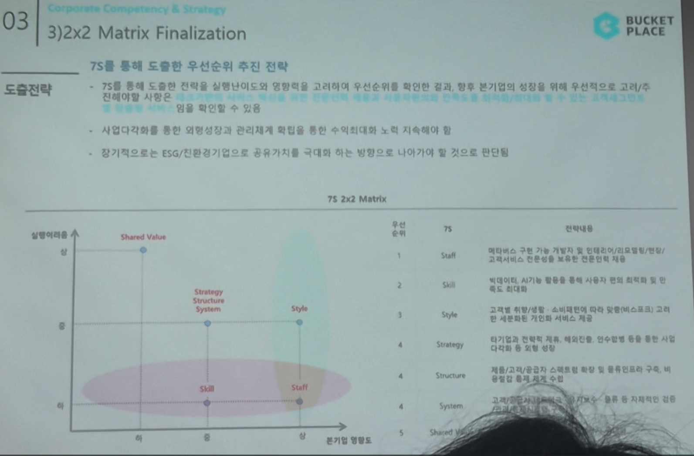

# Page 42 — 2x2 Matrix Finalization

## 섹션: 03 Corporate Competency & Strategy > 3) 2x2 Matrix Finalization

## 7S를 통해 도출한 우선순위 추진 전략

### 도출전략 요약
- 7S를 통해 도출한 전략을 **실행 난이도**와 **영향도**를 고려하여 우선순위를 확인한 결과, 향후 본기업의 전략을 위해 **우선적으로 고려/추진해야 할 사항**을 확인할 수 있음
- **사업다각화를 통한 외형성장**과 **관리체계 확립**을 통한 **수익극대화** 노력 지속해야 함
- **장기적으로는 ESG/친환경기업**으로 공유가치를 극대화 하는 방향으로 나아가야 할 것으로 판단

### 7S 2x2 Matrix (실행난이도 vs. 본기업 영향도)

| 순위 | 7S | 전략내용 |
|------|-----|---------|
| 1 | **Staff** | 메타버스 구현 가능 개발자 및 인테리어/리모델링/편집/고객서비스 전문성을 보유한 전문인력 채용 |
| 2 | **Skill** | 빅데이터, AI/5G 활용을 통해 사용자 최적화 및 인지도 확대 |
| 3 | **Style** | 고객별 맞춤/비스포크: 소비패턴에 따라 맞춤(비스포크), 고객의 세분화된 개인화 서비스 제공 |
| 4 | **Strategy** | 타기업과 전략적 제휴, 해외진출, 인수합병 등을 통한 사업다각화 및 외형 성장 |
| 5 | **Structure** | 매출 및 비용절감에 집중 및 물류인프라 구축, 비용절감 통한 재계 수입 확보 |
| 6 | **System** | 자체물류센터 확보 및 물류/배송 시스템 구축, 유통일 및 통합적 관리 체계 |
| 7 | **Shared Value** | ESG/친환경 경영을 통한 공유가치 극대화 |

### 매트릭스 위치 (실행난이도 높음 → 낮음, 본기업 영향도 높음 → 낮음)
- **고영향·저난이도** (우선 추진): Staff, Skill
- **고영향·고난이도** (전략적 추진): Strategy, Structure, System
- **저영향·저난이도** (장기과제): Style
- **저영향·고난이도** (최후순위): Shared Value
