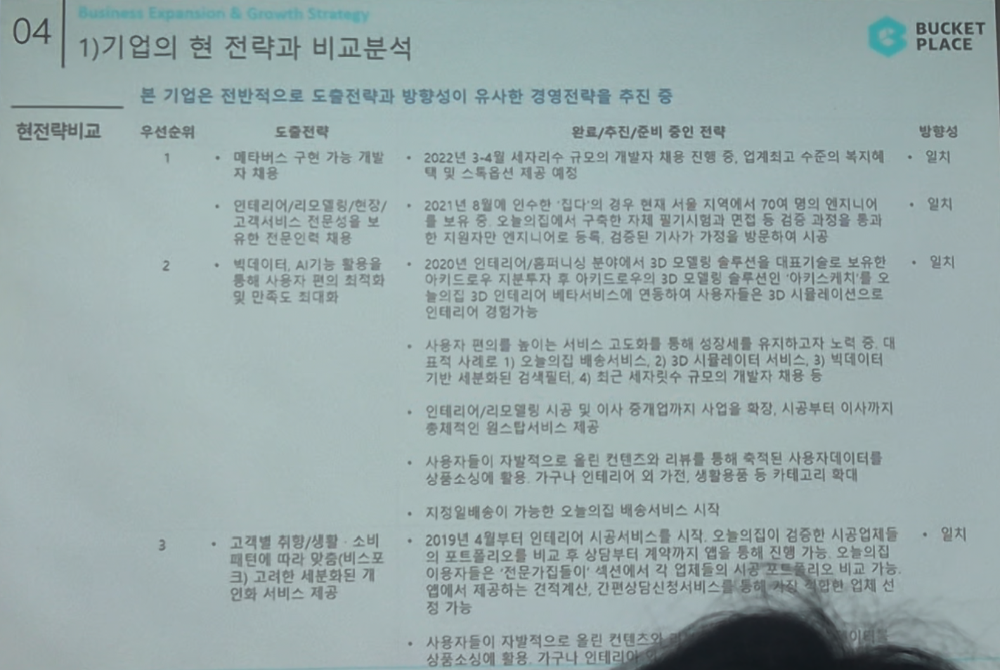

# Page 44 — 기업의 현 전략과 비교분석 (1/2)

## 섹션: 04 Business Expansion & Growth Strategy > 1) 기업의 현 전략과 비교분석

## 현전략 비교: 본 기업은 전반적으로 도출전략과 방향성이 유사한 경영전략을 추진 중

| 우선순위 | 도출전략 | 완료/추진/준비 중인 전략 | 활성도 |
|---------|---------|-------------------|------|
| **1. 메타버스 구현 가능 개발자 채용** | 2022년 3~4월 대규모의 개발자 채용 진행 중, 업계최고 수준의 보직 및 스톡옵션 조건 제시 | 완료 | 일부 |
| **2. 인테리어/리모델링/편집/고객서비스 전문성을 보유한 전문인력 채용** | 2021년 '집다' 인수·'집다' 인력 결합 약 70여 명의 엔지니어 보유. 오늘의집에서 구축한 시각 분석기제를 통해 인테리어/시공서비스 전문 기반 확대 | 완료 | 일부 |
| **3. 빅데이터, AI기능 활용** | 2020년 인테리어 서비스 업그레이드로 3D 인테리어 배치서비스 연동, 사용자포부에 의한 3D 시뮬레이션으로 인테리어 접근 가능 | 진행 중 | 일부 |
| - | 사용자 편의를 높이는 서비스 고도화를 통해 월활성화를 유지하고자 노력. 대표 사례로: 1) 오늘의집 배송서비스 2) 3D시뮬레이터 서비스 3) 빅데이터 검색엔진 4) 최근 세지만큼 규모의 개발자 채용 등 | 진행 중 | - |
| - | 인테리어/리모델링 시공 및 이사 중개까지 사업 확장, 시공부터 이사가치 종합적인 원스톱 서비스로 발전 | 진행 중 | - |
| - | 사용자들이 자발적으로 올린 컨텐츠와 리뷰를 통해 축적된 사용자데이터를 활용, 상품소비에 관련 가구나 인테리어 외 가구니 상품류 확보 및 수익 확대 | 진행 중 | - |
| - | 자체물류인프라 기반의 오늘의집 배송서비스 시작 | 완료 | - |
| - | **고객별 맞춤/세분화된 서비스 제공** | - | - |
| - | 2019년 4월 인테리어 시공서비스 시작, 오늘의집이 검증한 시공업체의 포트폴리오를 비교 → 상담부터 계약까지 앱을 통해 진행 가능. 오늘의집의 이용자들은 '건축기간별' 섹션에서 각 업체의 시공사례와 견적, 건축양식 차별화 서비스 확대 | 일부 진행 | - |
| - | 사용자들이 자발적으로 올린 컨텐츠와 상품소비에서 가구나 인테리어 외 범위 확대 | 진행 중 | - |
