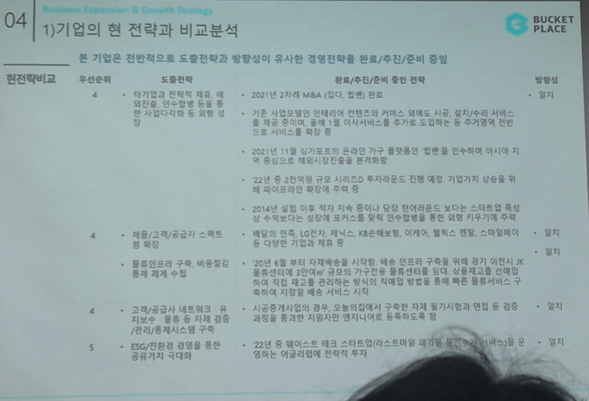

# Page 45 — 기업의 현 전략과 비교분석 (2/2)

## 섹션: 04 Business Expansion & Growth Strategy > 1) 기업의 현 전략과 비교분석

## 현전략 비교 (계속)

| 우선순위 | 도출전략 | 완료/추진/준비 중인 전략 | 활성도 |
|---------|---------|-------------------|------|
| **4. 타기업과 전략적 제휴, 해외진출, 인수합병 등을 통한 사업다각화 및 외형 성장** | 2021년 2차례 M&A (집다, 하플란) 진행 완료. 컨텐츠와 커머스 결합에서 시공/이사/수리 서비스 등 전방 및 후방 서비스 체인 확장 → 종합 인테리어 플랫폼으로 사업 다각화를 도모하는 전략으로 진행 중 | 완료 | 일부 |
| - | 2021년 11월 시가총액 기준 온라인 가구 플랫폼 중 전반을 장악하며 오늘의집 이사/시뮬 유통시장에까지 해외시장의 진출을 분석적으로 진행 예정 | 준비 중 | - |
| - | 22년 중 2천억원 규모의 시리즈D 투자라운드 진행 예정. 기업가치 상승을 위해 파이프라인의 확장에 주력하여 예정 | 준비 중 | - |
| - | 2014년 설립 이후 적자 지속 중이나 유니콘 기업(1조원 이상)으로 보이는 스타트업의 매출 확대 및 상장까지의 포커스를 맞추어 영업수익을 확대하여 수익성 전환을 달성해야 할 시점 | 진행 중 | - |
| **4-1. 제품/고객/공급자 스펙트럼 확대** | 매일 만족, LG전자, 자에스, KB손해보험, 이마트/면리전, 현대/스마트홈/비 등 다양한 기업과 제휴 | 일부 진행 | - |
| **4-2. 물류인프라 구축, 비용절감** | 2018년 6월 약 자체재원으로 취급한 1만어큐의 규모의 가구전용 물류센터를 개관. 상류결산고를 내소 자산으로 확보하여 직접 재고를 관리하는 방식의 직매입 방식을 통한 물류서비스 구축. 수익의 자체적 배송 서비스 시작 | 완료 | - |
| **5. 고객/공급자 네트워크 구축** | 시공중개사업의 경우, 오늘의집에서 구축된 자체 등기시험과 연락 등을 검증, 감독을 통하여 자회사인 엔지니어들을 적극적으로 활용 | 진행 중 | - |
| - | 고객/공급자 네트워크의 자보수·등록 등의 자체 겸용 | 진행 중 | - |
| **6. ESG/친환경 경영을 통한 공유가치 극대화** | 21년 중 해리스트 대표 스타트업(인스/트토레일 등) 대기업과 연결하여 ESG 관련 분야의 어젠다/업계에 전략적 투자 | 준비 중 | - |
