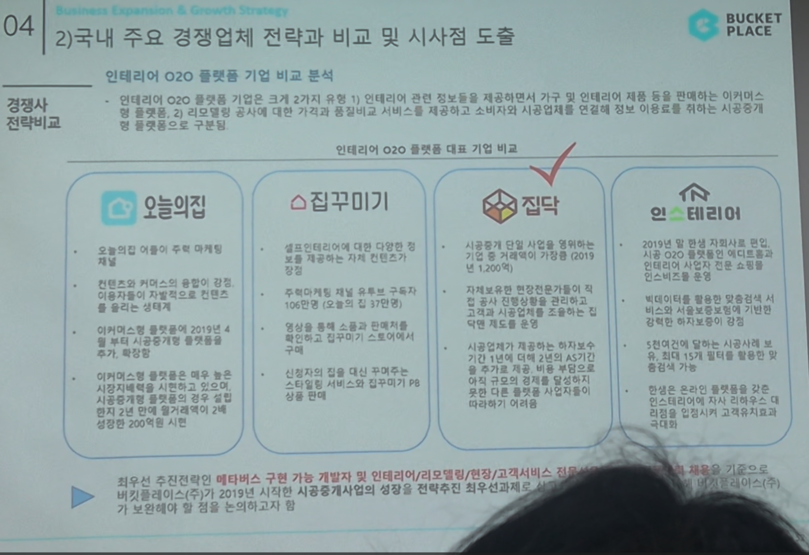

# Page 46 — 국내 주요 경쟁업체 전략과 비교 및 시사점 도출: O2O 플랫폼 비교

## 섹션: 04 Business Expansion & Growth Strategy > 2) 국내 주요 경쟁업체 전략과 비교 및 시사점 도출

## 인테리어 O2O 플랫폼 기업 비교 분석

인테리어 O2O 플랫폼 기업은 크게 2가지로 분류:
1. 인테리어에 관한 컨텐츠를 제공하면서 가구 및 인테리어 제품을 판매하는 이용자 기반 커머스 플랫폼
2. 인테리어 시공 중개를 핵심으로 소비자가 시공업체를 온라인 검색/선정할 수 있는 시공중개 플랫폼

### 인테리어 O2O 플랫폼 대표 기업 비교

| | 오늘의집 | 집꾸미기 | 집닥 | 인스테리어 |
|---|---------|---------|------|----------|
| **특징** | 오늘의집 이용자 주목 마케팅, 컨텐츠와 커머스의 융합이 강점. 가구/인테리어 기반으로 컨텐츠를 통해 자연스러운 구매 전환 구조 | 시공부터 디자인 시공연결 모든 분야에서 컨텐츠 기반 서비스. 월 거래액 약 1,300억원 달성 | 시공중개 단일 시공업체 연결로 전국에 시공업체 네트워크 보유. 106만건 이상 시공 매칭 | 2019년 정식 런칭. 시공 분야의 AR 기반 O2O 플랫폼 |
| **커머스** | 이커머스형 플랫폼을 2019년 4월부터 가구판매 및 시공중개까지 확대. 상품수 200만+, 브랜드 2,000+ | 인테리어 제품 및 소품 판매 중 | - | 시공 전문 플랫폼 |
| **강점** | 컨텐츠→커머스 선순환, 독점적 MAU | 신입자 최적화된 대상 니즈 파악으로 스타트업식 서비스 확장 가능 | 시공 중개 전문. 시공업체 검증 및 A/S 서비스 | AR 기반 서비스 차별화 |

## 핵심 시사점
- 최우선 추진전략인 **메타버스 구현 가능 개발자 및 인테리어/리모델링/편집/고객서비스** 전문성 보유 전문인력 채용은 전략적으로 가장 중요
- 버킷플레이스(오늘의집)가 2019년 시작한 **시공중개사업의 성장을 전략적으로 확보**하면서 기존 보유한 역량의 시너지가 가장 큰 전략으로 판단
