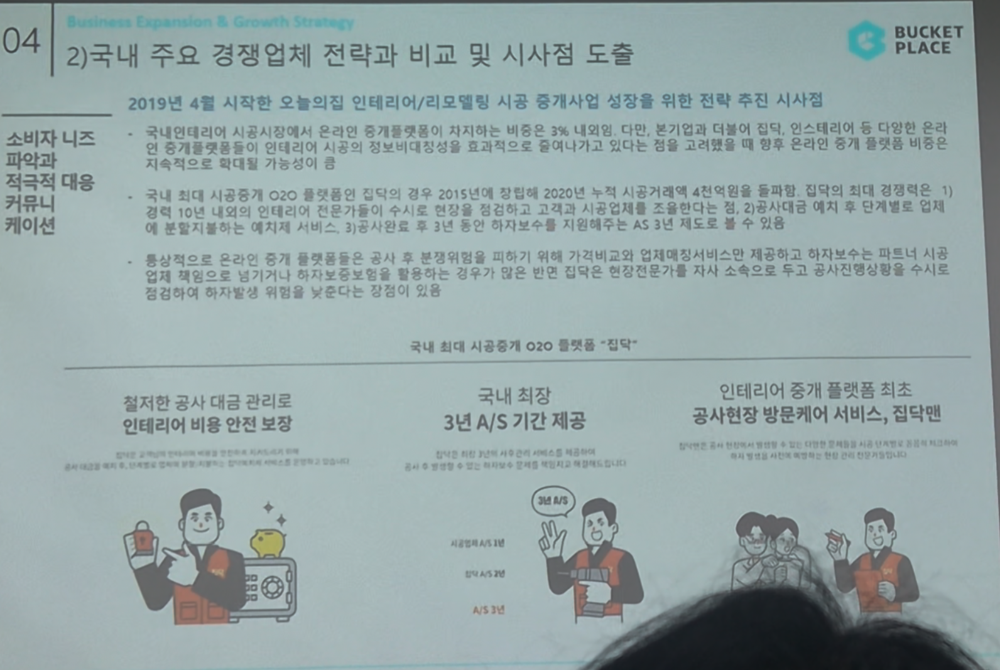

# Page 47 — 경쟁업체 비교: 집닥 사례 분석 (소비자 니즈 대응)

## 섹션: 04 Business Expansion & Growth Strategy > 2) 국내 주요 경쟁업체 전략과 비교 및 시사점 도출

## 소비자 니즈 파악과 적극적 대응 커뮤니케이션

### 집닥의 시공중개 전략 시사점
- 2019년 4월 시작한 오늘의집 인테리어/리모델링 시공 중개사업 성장을 위한 전략 추진 시사점
- 국내대형사의 시공서비스에서는 온라인의 중개플랫폼의 자체적 비용이나 이익에 영향을 주어 비용 부담 → 온라인업체의 더 다양한 서비스 중개 플랫폼들이 연이어 시장의 불편함/대칭정보 비효과적 구조에서 벗어나 → 고객만족 향상의 주요 온라인 중개 사업의 성장 가능성이 있음
- 국내 최대 시공중개 O2O 플랫폼인 집닥은 2015년과 2022년 사이 다수의 대형 투자 및 전략적 제휴를 진행하여 시장 확대에 성공한 A/S 제도는 큰 차별화 요소

### 국내 최대 시공중개 O2O 플랫폼 '집닥'의 핵심 강점

| 강점 | 설명 |
|------|------|
| **철저한 공사 대금 관리로 인테리어 비용 안전 보장** | 공사 진행에 따른 대금 관리, 소비자 보호 시스템 |
| **국내 최장 3년 A/S 기간 제공** | 시공 후 3년간 A/S 보증 — 업계 최장 기간. 사고보장 보장 포함 |
| **인테리어 중개 플랫폼 최초 공사현장 방문케어 서비스, 집닥맨** | 현장에서 직접 시공 과정을 확인하는 전문인력 배치. 현장 방문 케어로 시공 품질 관리 |
