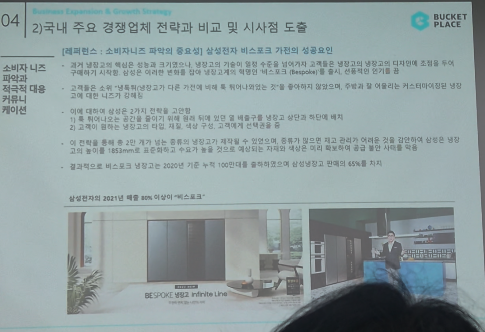

# Page 48 — 경쟁업체 비교: 삼성전자 비스포크 사례 (레퍼런스)

## 섹션: 04 Business Expansion & Growth Strategy > 2) 국내 주요 경쟁업체 전략과 비교 및 시사점 도출

## [레퍼런스: 소비자니즈 파악의 중요성] 삼성전자 비스포크 기전의 성공요인

### 비스포크(Bespoke) 성공 배경
- 과거 냉장고의 핵심은 성능과 크기였으나, 냉장고의 기능이 일정 수준을 넘어가자 고객들의 대다수에 초점을 두지 않고 **개인화된 디자인과 공간 적합성**에 집중
- 삼성은 이러한 변화를 읽어 내장형 고객에게 **맞춤형 비스포크(Bespoke)** 출시 → 트렌드의 전환기를 성공적으로 포착

### 비스포크 2가지 핵심 고객 인사이트
1. **톡 튀어나오는 공간을 줄이기 위해 설치 위치에 딱 맞는 배송구를 만들고** 상단과 하단에 배치 → 고객이 원하는 이러한 세밀한 요구를 파악하여 디자인에 반영
2. **여러 컬러를 통해 약 2만 가지 넘은 종류의 냉장고가 제작됨** → 증가가 되어져도 재고 관리가 어려운 것을 **간단하게 삼성은 냉장고 높이를 185mm로 표준화**하여 수백 가지로 줄여 제조·유통 효율성 극대화

### 결과
- 비스포크 냉장고는 2020년 기준 누적 100만대를 돌파하였으며 삼성냉장고 전체의 **65%**를 차지
- **삼성전자의 2021년 매출 중 80% 이상이 "비스포크"** 라인

### 시사점 (오늘의집에 적용)
- 고객 맞춤형/비스포크식 접근이 성공의 핵심
- 오늘의집도 사용자 개인화 니즈에 맞춘 인테리어 서비스 고도화 필요
- 표준화된 프레임 위에 개인화 옵션을 제공하는 전략이 효과적
