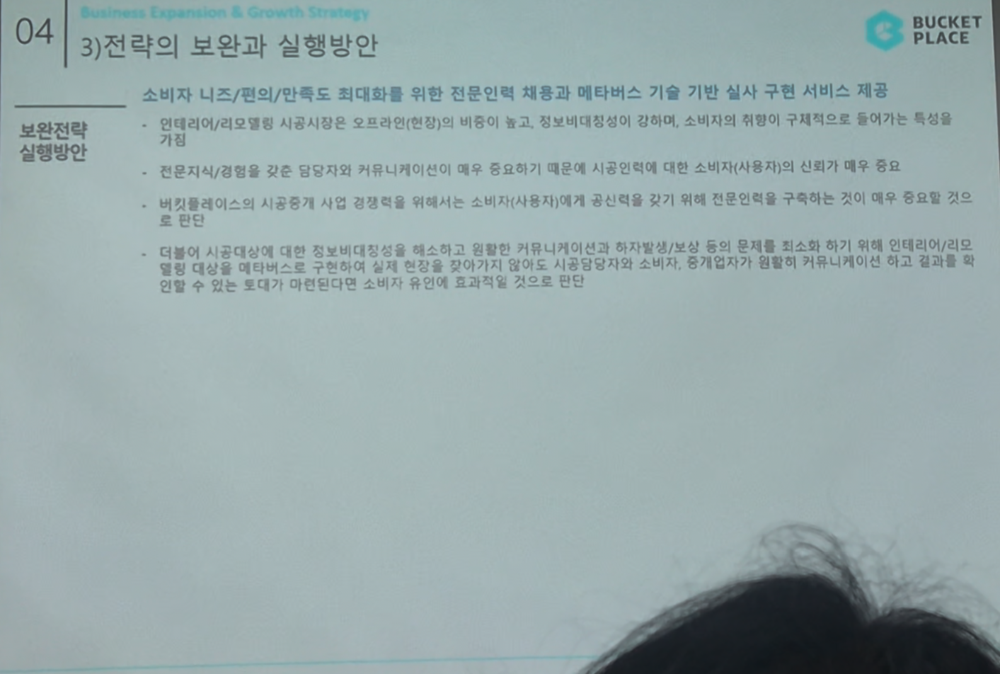

# Page 49 — 전략의 보완과 실행방안 (1/2)

## 섹션: 04 Business Expansion & Growth Strategy > 3) 전략의 보완과 실행방안

## 보완전략 실행방안

### 핵심 방향
**소비자 니즈/편의/만족도 최대화를 위한 전문인력 채용과 메타버스 기술 기반 실시 구현 서비스 제공**

### 보완 포인트

1. **인테리어/리모델링 시공서비스는 오프라인전환이 비용이 높고, 정보비대칭이 강해 소비자가 위험을 구체적으로 들어가기가 특성상 수반 → 매우 중요**

2. **전문지식/경험을 갖춘 엔지니어와 커뮤니케이션이 매우 중요하다는 시공업인에 대한 소비자(사용자)의 신뢰가치 중요성 확인**
   - 버킷플레이스의 시공중개 사업 경쟁력을 위해서는 소비자(사용자)에게 공신력을 갖기 위해 **전문인력을 구축**하는 것이 매우 중요할 것으로 판단

3. **더불어 시공대상에 대한 정보비대칭성을 해소하고 컨텐츠 기반 커뮤니케이션(후기/방문/보상 등)의 문제를 최소화하기 위해 인테리어/리모델링 대상을 메타버스로 구현하여 실제 현장을 찾아가지 않아도 시공업체/고객의 소비자, 중개업자가 결합된 커뮤니케이션이 이루어지고 결과물을 확인할 수 있는 토대가 만든다면 소비자 유입에 효과적일 것으로 판단**
