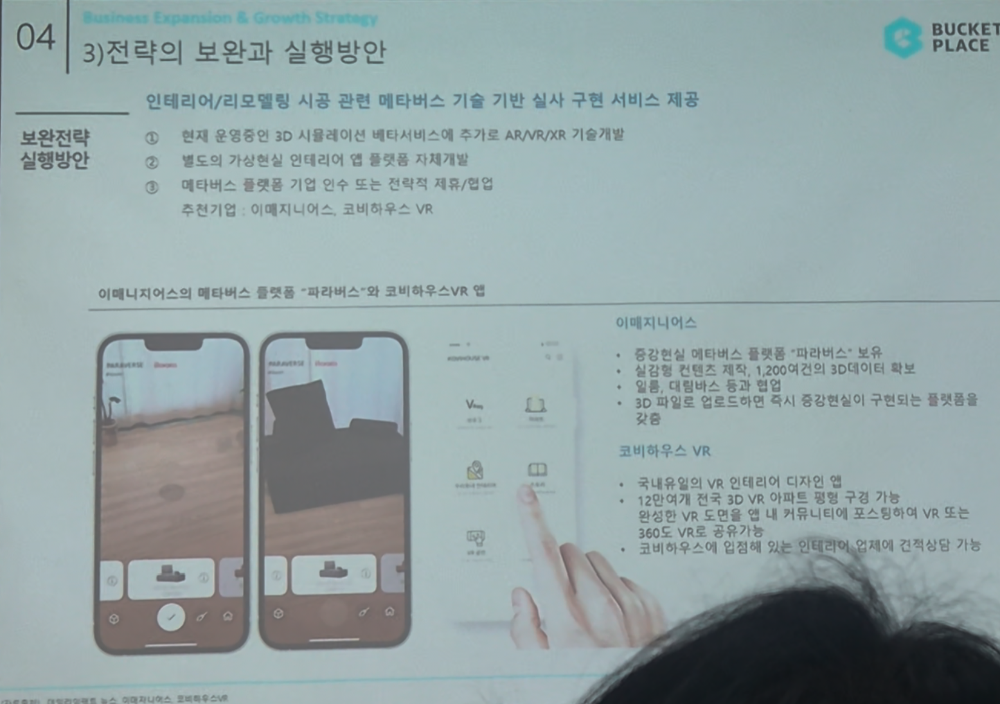

# Page 50 — 전략의 보완과 실행방안 (2/2): 메타버스 기술 기반 실시 구현

## 섹션: 04 Business Expansion & Growth Strategy > 3) 전략의 보완과 실행방안

## 보완전략: 인테리어/리모델링 시공 관련 메타버스 기술 기반 실시 구현 서비스 제공

### 현재 → 미래 기술 로드맵
- **현재**: 운영중인 3D 시뮬레이션 메타서비스에 추가로 **AR/VR/XR 기술 개발**
- **별도의 가상현실 인테리어 앱 플랫폼 자체개발**
- **메타버스 플랫폼 기업 인수 또는 전략적 제휴/협업**

### 추천기업 사례

#### 이매지니어스 (Imaginears)
- 중합컨텐츠 **메타버스 플랫폼 '파라버스'** 보유
- 실감형 컨텐츠 개발 및 1,200여건의 3D데이터 확보
- 결론: 다양한 메타버스 통합 확장 가능
- **3D 파일로 업로드하면 즉시 공간컨텐츠가 구현**되는 플랫폼을 보유

#### 코비하우스 VR (Cobi House VR)
- **국내 유일의 VR 인테리어 디자인 앱**
- 12만여개 전문 **3D VR 아파트 평면 구조** 기반
- 현장인 VR 공간 내 **커뮤니티에서 포스트/리뷰** VR 또는 공간으로 게시 가능
- 코비하우스에 임점하면 되는 인테리어 업체에 **전략적으로 진출 가능**

### 최종 결론
- 오늘의집이 보유한 **UGC 컨텐츠 + 3D 시뮬레이션**에 **AR/VR/XR 메타버스 기술**을 결합하면
- 시공업체·소비자·중개업자가 가상공간에서 커뮤니케이션하는 **차세대 인테리어 플랫폼**으로 진화 가능
- 이를 통해 정보비대칭 해소, 시공 품질 향상, 소비자 만족도 극대화 달성 기대
